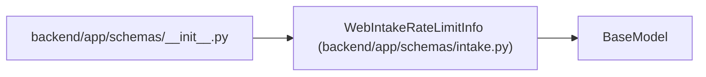

# WebIntakeRateLimitInfo

**Location:** `backend/app/schemas/intake.py:73`
**Kind:** Pydantic model
**Bases:** `BaseModel`
**Module:** [schemas_intake](../modules/schemas_intake.md)

## Description

Rate-limit details returned on rejection.

## Attributes

| Name | Type | Wire name | Required | Nullable | Default | Constraints | Examples | Description |
|------|------|-----------|----------|----------|---------|-------------|-------------|----------|
| `retry_after_seconds` | `int` | `retry_after_seconds` | Yes | No | — | — | — | — |
| `limit` | `int` | `limit` | Yes | No | — | — | — | — |
| `window_seconds` | `int` | `window_seconds` | Yes | No | — | — | — | — |
| `client_ip` | `str` | `client_ip` | Yes | No | — | — | — | — |
| `reset_at` | `datetime` | `reset_at` | Yes | No | — | — | — | — |

## Methods

*No public methods. Inherits from base classes.*

## Relationships

<!-- Auto-generated relationship summary. Do not edit by hand. -->

### Summary

| Module | Methods | Attributes |
|---|---:|---|
| [schemas_intake](../modules/schemas_intake.md) | 0 | `client_ip`, `limit`, `reset_at`, `retry_after_seconds`, `window_seconds` |

### Structure

| Kind | Entity | Module |
|---|---|---|
| Base | `BaseModel` | — |

### References

| Reference | Kind | Source | Call sites |
|---|---|---|---:|
| `__init__` | import | [schemas___init__](../modules/schemas___init__.md) | — |
