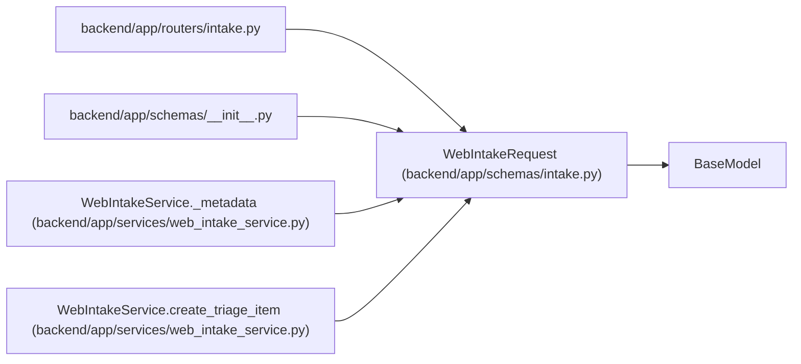

# WebIntakeRequest

**Location:** `backend/app/schemas/intake.py:8`
**Kind:** Pydantic model
**Bases:** `BaseModel`
**Module:** [schemas_intake](../modules/schemas_intake.md)

## Description

External web/form intake payload.

## Model Configuration

| Setting | Value | Source |
|---------|-------|--------|
| `extra` | `'forbid'` | model_config |

## Validators

| Method | Scope | Fields | Mode | Options |
|--------|-------|--------|------|---------|
| `normalize_title` | field | title | after | — |
| `normalize_optional_text` | field | description, source_url, external_key, assignee_hint | after | — |
| `normalize_source` | field | source | after | — |
| `normalize_labels` | field | labels | after | — |
| `validate_metadata` | model | — | after | — |

## Attributes

| Name | Type | Wire name | Required | Nullable | Default | Constraints | Examples | Description |
|------|------|-----------|----------|----------|---------|-------------|-------------|----------|
| `title` | `str` | `title` | Yes | No | — | min_length=1; max_length=500 | — | — |
| `description` | `Optional[str]` | `description` | No | Yes | `None` | — | — | — |
| `source` | `Optional[str]` | `source` | No | Yes | `'web'` | max_length=100 | — | — |
| `source_url` | `Optional[str]` | `source_url` | No | Yes | `None` | max_length=1000 | — | — |
| `external_key` | `Optional[str]` | `external_key` | No | Yes | `None` | max_length=255 | — | — |
| `priority_hint` | `Optional[int]` | `priority_hint` | No | Yes | `None` | ge=1; le=10 | — | — |
| `assignee_hint` | `Optional[str]` | `assignee_hint` | No | Yes | `None` | max_length=255 | — | — |
| `project_hint_id` | `Optional[int]` | `project_hint_id` | No | Yes | `None` | — | — | — |
| `iteration_hint_id` | `Optional[int]` | `iteration_hint_id` | No | Yes | `None` | — | — | — |
| `labels` | `list[str]` | `labels` | No | No | factory: `list` | — | — | — |
| `metadata_json` | `dict[str, Any]` | `metadata_json` | No | No | factory: `dict` | — | — | — |

## Methods

| Method | Signature | Decorators | Description |
|--------|-----------|------------|-------------|
| `normalize_title` | `(value: str) -> str` | `@field_validator('title')`, `@classmethod` | Reject blank titles after trimming. |
| `normalize_optional_text` | `(value: Optional[str]) -> Optional[str]` | `@field_validator('description', 'source_url', 'external_key', 'assignee_hint')`, `@classmethod` | Trim optional text fields. |
| `normalize_source` | `(value: Optional[str]) -> str` | `@field_validator('source')`, `@classmethod` | Default blank source values to web. |
| `normalize_labels` | `(value: list[str]) -> list[str]` | `@field_validator('labels')`, `@classmethod` | Trim labels and remove duplicates while preserving order. |
| `validate_metadata` | `()` | `@model_validator(mode='after')` | Keep metadata JSON object-shaped for predictable storage. |

## Relationships

<!-- Auto-generated relationship summary. Do not edit by hand. -->

### Summary

| Module | Methods | Attributes |
|---|---:|---|
| [schemas_intake](../modules/schemas_intake.md) | 5 | `assignee_hint`, `description`, `external_key`, `iteration_hint_id`, `labels`, `metadata_json`, `priority_hint`, `project_hint_id`, `source`, `source_url`, `title` |

### Structure

| Kind | Entity | Module |
|---|---|---|
| Base | `BaseModel` | — |

### References

| Reference | Kind | Source | Call sites |
|---|---|---|---:|
| `intake` | import | [routers_intake](../modules/routers_intake.md) | — |
| `__init__` | import | [schemas___init__](../modules/schemas___init__.md) | — |
| `WebIntakeService._metadata` | type_reference | [web_intake_service](../modules/web_intake_service.md) | — |
| `WebIntakeService.create_triage_item` | type_reference | [web_intake_service](../modules/web_intake_service.md) | — |
