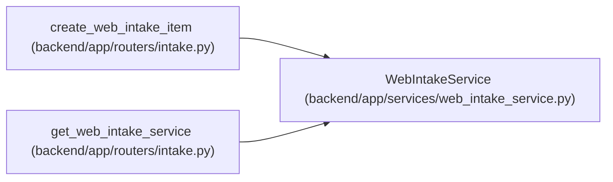

# WebIntakeService

**Location:** `backend/app/services/web_intake_service.py:103`
**Kind:** Class
**Bases:** —
**Module:** [web_intake_service](../modules/web_intake_service.md)

## Description

Validate controlled intake submissions and create triage items.

## Attributes

*No annotated attributes found.*

## Methods

| Method | Signature | Decorators | Description |
|--------|-----------|------------|-------------|
| `__init__` | `(db: AsyncSession, *, token: str, rate_limit_per_minute: int = 30, rate_limiter: WebIntakeRateLimiter = default_web_intake_rate_limiter)` | — | — |
| `verify_authorization` | `(authorization_header: Optional[str]) -> None` | — | Validate configured bearer token auth. |
| `check_rate_limit` | `(client_ip: str) -> None` | — | Enforce the configured per-IP fixed-window limit. |
| `_metadata` | `(data: WebIntakeRequest, *, client_ip: str, user_agent: Optional[str]) -> dict` | — | Merge caller metadata with trusted intake metadata. |
| `create_triage_item` | *(async)* `(data: WebIntakeRequest, *, authorization_header: Optional[str], client_ip: str, user_agent: Optional[str])` | — | Authenticate, rate-limit, and create a triage item. |

## Relationships

<!-- Auto-generated relationship summary. Do not edit by hand. -->

### Summary

| Module | Methods | Attributes |
|---|---:|---|
| [web_intake_service](../modules/web_intake_service.md) | 5 | — |

### References

| Reference | Kind | Source | Call sites |
|---|---|---|---:|
| `create_web_intake_item` | type_reference | [routers_intake](../modules/routers_intake.md) | — |
| `get_web_intake_service` | call | [routers_intake](../modules/routers_intake.md) | 1 |
| `get_web_intake_service` | type_reference | [routers_intake](../modules/routers_intake.md) | — |
