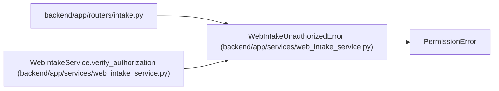

# WebIntakeUnauthorizedError

**Location:** `backend/app/services/web_intake_service.py:21`
**Kind:** Class
**Bases:** `PermissionError`
**Module:** [web_intake_service](../modules/web_intake_service.md)

## Description

Raised when an intake request is not authenticated.

## Attributes

*No annotated attributes found.*

## Methods

*No public methods. Inherits from base classes.*

## Relationships

<!-- Auto-generated relationship summary. Do not edit by hand. -->

### Summary

| Module | Methods | Attributes |
|---|---:|---|
| [web_intake_service](../modules/web_intake_service.md) | 0 | — |

### Structure

| Kind | Entity | Module |
|---|---|---|
| Base | `PermissionError` | — |

### References

| Reference | Kind | Source | Call sites |
|---|---|---|---:|
| `intake` | import | [routers_intake](../modules/routers_intake.md) | — |
| `WebIntakeService.verify_authorization` | call | [web_intake_service](../modules/web_intake_service.md) | 2 |
