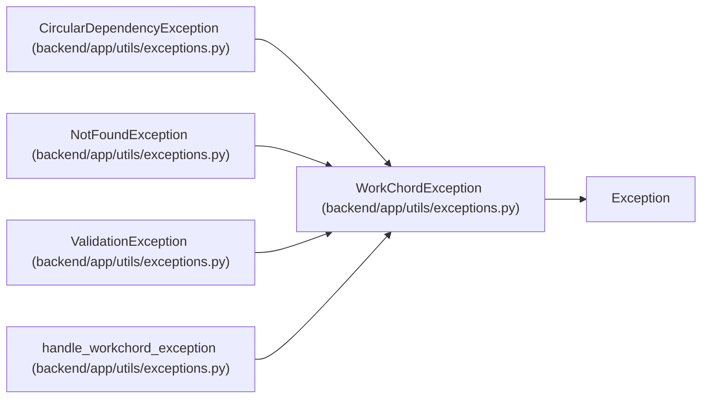

# WorkChordException

**Location:** `backend/app/utils/exceptions.py:12`
**Kind:** Class
**Bases:** `Exception`
**Module:** [exceptions](../modules/exceptions.md)

## Description

Base exception for the application.

## Attributes

*No annotated attributes found.*

## Methods

| Method | Signature | Decorators | Description |
|--------|-----------|------------|-------------|
| `__init__` | `(message: str, code: str = 'error')` | — | — |

## Relationships

<!-- Auto-generated relationship summary. Do not edit by hand. -->

### Summary

| Module | Methods | Attributes |
|---|---:|---|
| [exceptions](../modules/exceptions.md) | 1 | — |

### Structure

| Kind | Entity | Module |
|---|---|---|
| Base | `Exception` | — |
| Subclass | `CircularDependencyException` | [exceptions](../modules/exceptions.md) |
| Subclass | `NotFoundException` | [exceptions](../modules/exceptions.md) |
| Subclass | `ValidationException` | [exceptions](../modules/exceptions.md) |

### References

| Reference | Kind | Source | Call sites |
|---|---|---|---:|
| `handle_workchord_exception` | type_reference | [exceptions](../modules/exceptions.md) | — |
