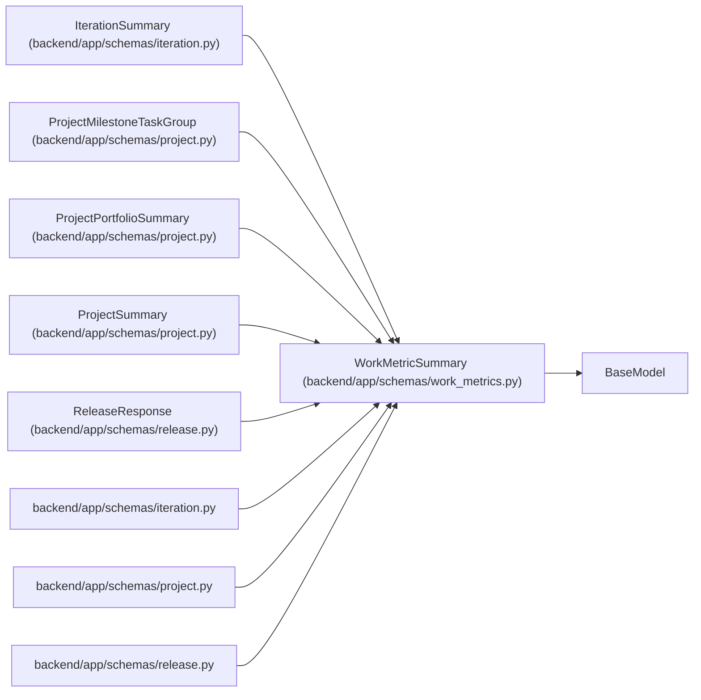

# WorkMetricSummary

**Location:** `backend/app/schemas/work_metrics.py:6`
**Kind:** Pydantic model
**Bases:** `BaseModel`
**Module:** [schemas_work_metrics](../modules/schemas_work_metrics.md)

## Description

_Auto-generated from `WorkMetricSummary` in `backend/app/schemas/work_metrics.py`._

## Attributes

| Name | Type | Wire name | Required | Nullable | Default | Constraints | Examples | Description |
|------|------|-----------|----------|----------|---------|-------------|-------------|----------|
| `metric_contract_version` | `int` | `metric_contract_version` | No | No | `2` | — | — | — |
| `required_tasks` | `int` | `required_tasks` | No | No | `0` | — | — | — |
| `optional_tasks` | `int` | `optional_tasks` | No | No | `0` | — | — | — |
| `deferred_tasks` | `int` | `deferred_tasks` | No | No | `0` | — | — | — |
| `structural_tasks` | `int` | `structural_tasks` | No | No | `0` | — | — | — |
| `implemented_tasks` | `int` | `implemented_tasks` | No | No | `0` | — | — | — |
| `accepted_tasks` | `int` | `accepted_tasks` | No | No | `0` | — | — | — |
| `required_implemented_tasks` | `int` | `required_implemented_tasks` | No | No | `0` | — | — | — |
| `required_accepted_tasks` | `int` | `required_accepted_tasks` | No | No | `0` | — | — | — |
| `late_start_tasks` | `int` | `late_start_tasks` | No | No | `0` | — | — | — |
| `iteration_overflow_tasks` | `int` | `iteration_overflow_tasks` | No | No | `0` | — | — | — |
| `project_target_overflow_tasks` | `int` | `project_target_overflow_tasks` | No | No | `0` | — | — | — |
| `acceptance_unknown_tasks` | `int` | `acceptance_unknown_tasks` | No | No | `0` | — | — | — |
| `unknown_estimate_tasks` | `int` | `unknown_estimate_tasks` | No | No | `0` | — | — | — |
| `accepted_percent` | `float` | `accepted_percent` | No | No | `0.0` | — | — | — |

## Methods

*No public methods. Inherits from base classes.*

## Relationships

<!-- Auto-generated relationship summary. Do not edit by hand. -->

### Summary

| Module | Methods | Attributes |
|---|---:|---|
| [schemas_work_metrics](../modules/schemas_work_metrics.md) | 0 | `acceptance_unknown_tasks`, `accepted_percent`, `accepted_tasks`, `deferred_tasks`, `implemented_tasks`, `iteration_overflow_tasks`, `late_start_tasks`, `metric_contract_version`, `optional_tasks`, `project_target_overflow_tasks`, `required_accepted_tasks`, `required_implemented_tasks` |

### Structure

| Kind | Entity | Module |
|---|---|---|
| Base | `BaseModel` | — |
| Subclass | `IterationSummary` | [schemas_iteration](../modules/schemas_iteration.md) |
| Subclass | `ProjectMilestoneTaskGroup` | [schemas_project](../modules/schemas_project.md) |
| Subclass | `ProjectPortfolioSummary` | [schemas_project](../modules/schemas_project.md) |
| Subclass | `ProjectSummary` | [schemas_project](../modules/schemas_project.md) |
| Subclass | `ReleaseResponse` | [schemas_release](../modules/schemas_release.md) |

### References

| Reference | Kind | Source | Call sites |
|---|---|---|---:|
| `iteration` | import | [schemas_iteration](../modules/schemas_iteration.md) | — |
| `project` | import | [schemas_project](../modules/schemas_project.md) | — |
| `release` | import | [schemas_release](../modules/schemas_release.md) | — |
