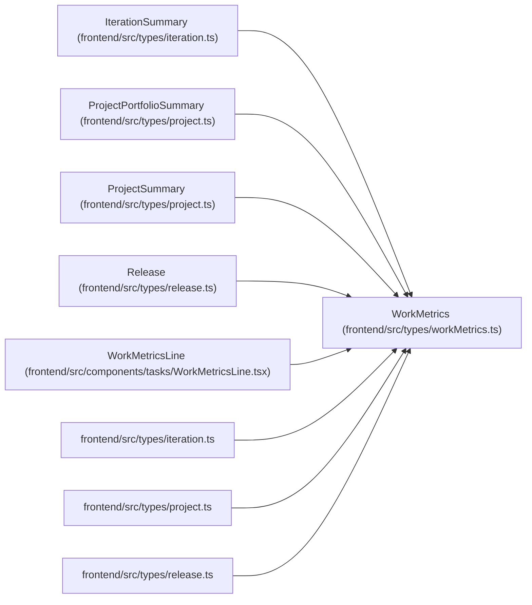

# WorkMetrics

**Location:** `frontend/src/types/workMetrics.ts:1`
**Kind:** Class
**Bases:** —
**Module:** [workMetrics](../modules/workMetrics.md)

## Description

_Auto-generated from `WorkMetrics` in `frontend/src/types/workMetrics.ts`._

## Attributes

| Name | Type | Default | Description |
|------|------|---------|-------------|
| `metric_contract_version` | `number` | *required* | — |
| `total_tasks` | `number` | *required* | — |
| `required_tasks` | `number` | *required* | — |
| `optional_tasks` | `number` | *required* | — |
| `structural_tasks` | `number` | *required* | — |
| `implemented_tasks` | `number` | *required* | — |
| `accepted_tasks` | `number` | *required* | — |
| `overdue_tasks` | `number` | *required* | — |
| `late_start_tasks` | `number` | *required* | — |
| `iteration_overflow_tasks` | `number` | *required* | — |
| `project_target_overflow_tasks` | `number` | *required* | — |
| `acceptance_unknown_tasks` | `number` | *required* | — |
| `accepted_percent` | `number` | *required* | — |

## Methods

*No public methods. Inherits from base classes.*

## Relationships

<!-- Auto-generated relationship summary. Do not edit by hand. -->

### Summary

| Module | Methods | Attributes |
|---|---:|---|
| [workMetrics](../modules/workMetrics.md) | 0 | `acceptance_unknown_tasks`, `accepted_percent`, `accepted_tasks`, `implemented_tasks`, `iteration_overflow_tasks`, `late_start_tasks`, `metric_contract_version`, `optional_tasks`, `overdue_tasks`, `project_target_overflow_tasks`, `required_tasks`, `structural_tasks` |

### Structure

| Kind | Entity | Module |
|---|---|---|
| Subclass | `IterationSummary` | [types_iteration](../modules/types_iteration.md) |
| Subclass | `ProjectPortfolioSummary` | [types_project](../modules/types_project.md) |
| Subclass | `ProjectSummary` | [types_project](../modules/types_project.md) |
| Subclass | `Release` | [types_release](../modules/types_release.md) |

### References

| Reference | Kind | Source | Call sites |
|---|---|---|---:|
| `WorkMetricsLine` | type_reference | [WorkMetricsLine](../modules/WorkMetricsLine.md) | — |
| `iteration` | import | [types_iteration](../modules/types_iteration.md) | — |
| `project` | import | [types_project](../modules/types_project.md) | — |
| `release` | import | [types_release](../modules/types_release.md) | — |
