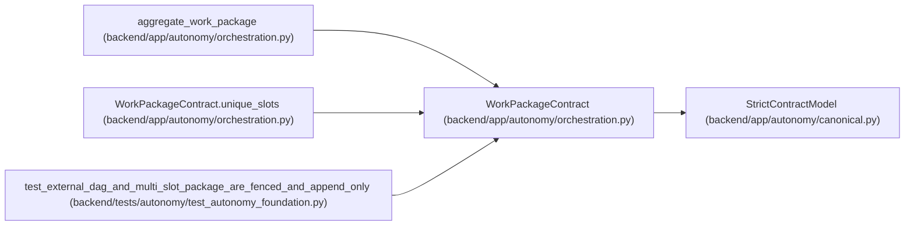

# WorkPackageContract

**Location:** `backend/app/autonomy/orchestration.py:440`
**Kind:** Pydantic model
**Bases:** `StrictContractModel`
**Module:** [orchestration](../modules/orchestration.md)

## Description

_Auto-generated from `WorkPackageContract` in `backend/app/autonomy/orchestration.py`._

## Validators

| Method | Scope | Fields | Mode | Options |
|--------|-------|--------|------|---------|
| `unique_slots` | model | — | after | — |

## Attributes

| Name | Type | Wire name | Required | Nullable | Default | Constraints | Examples | Description |
|------|------|-----------|----------|----------|---------|-------------|-------------|----------|
| `schema_version` | `Literal['agent-work-package-v1']` | `schema_version` | No | No | `'agent-work-package-v1'` | — | — | — |
| `package_id` | `str` | `package_id` | Yes | No | — | pattern=unknown (IDENTIFIER_PATTERN) | — | — |
| `package_version` | `int` | `package_version` | Yes | No | — | ge=1 | — | — |
| `execution_task_id` | `str \| None` | `execution_task_id` | No | Yes | `None` | pattern=unknown (IDENTIFIER_PATTERN) | — | — |
| `artifact_set_digest` | `str` | `artifact_set_digest` | Yes | No | — | pattern=unknown (SHA256_PATTERN) | — | — |
| `requirements` | `tuple[VerificationRequirementContract, ...]` | `requirements` | Yes | No | — | max_length=64; min_length=1 | — | — |
| `predecessor_package_digest` | `str \| None` | `predecessor_package_digest` | No | Yes | `None` | pattern=unknown (SHA256_PATTERN) | — | — |

## Methods

| Method | Signature | Decorators | Description |
|--------|-----------|------------|-------------|
| `unique_slots` | `() -> 'WorkPackageContract'` | `@model_validator(mode='after')` | — |

## Relationships

<!-- Auto-generated relationship summary. Do not edit by hand. -->

### Summary

| Module | Methods | Attributes |
|---|---:|---|
| [orchestration](../modules/orchestration.md) | 1 | `artifact_set_digest`, `execution_task_id`, `package_id`, `package_version`, `predecessor_package_digest`, `requirements`, `schema_version` |

### Structure

| Kind | Entity | Module |
|---|---|---|
| Base | `StrictContractModel` | [autonomy_canonical](../modules/autonomy_canonical.md) |

### References

| Reference | Kind | Source | Call sites |
|---|---|---|---:|
| `aggregate_work_package` | type_reference | [orchestration](../modules/orchestration.md) | — |
| `WorkPackageContract.unique_slots` | type_reference | [orchestration](../modules/orchestration.md) | — |
| `test_external_dag_and_multi_slot_package_are_fenced_and_append_only` | call | [test_autonomy_foundation](../modules/test_autonomy_foundation.md) | 1 |
