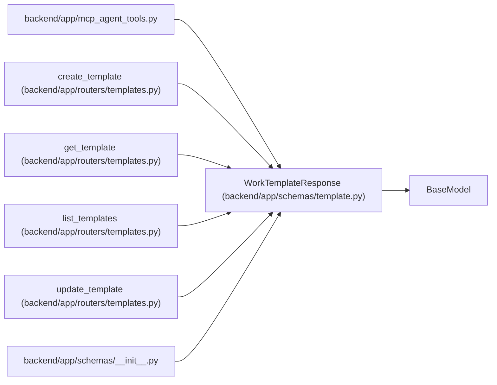

# WorkTemplateResponse

**Location:** `backend/app/schemas/template.py:52`
**Kind:** Pydantic model
**Bases:** `BaseModel`
**Module:** [schemas_template](../modules/schemas_template.md)

## Description

Schema for reusable work template responses.

## Model Configuration

| Setting | Value | Source |
|---------|-------|--------|
| `from_attributes` | `True` | model_config |

## Attributes

| Name | Type | Wire name | Required | Nullable | Default | Constraints | Examples | Description |
|------|------|-----------|----------|----------|---------|-------------|-------------|----------|
| `id` | `int` | `id` | Yes | No | — | — | — | — |
| `name` | `str` | `name` | Yes | No | — | — | — | — |
| `description` | `Optional[str]` | `description` | No | Yes | `None` | — | — | — |
| `seed_key` | `Optional[str]` | `seed_key` | No | Yes | `None` | — | — | — |
| `template_type` | `str` | `template_type` | Yes | No | — | — | — | — |
| `default_title` | `Optional[str]` | `default_title` | No | Yes | `None` | — | — | — |
| `default_description` | `Optional[str]` | `default_description` | No | Yes | `None` | — | — | — |
| `default_priority` | `Optional[int]` | `default_priority` | No | Yes | `None` | — | — | — |
| `default_effort_days` | `Optional[float]` | `default_effort_days` | No | Yes | `None` | — | — | — |
| `default_labels` | `list[str]` | `default_labels` | No | No | factory: `list` | — | — | — |
| `default_checklist` | `list[str]` | `default_checklist` | No | No | factory: `list` | — | — | — |
| `default_payload` | `dict[str, Any]` | `default_payload` | No | No | factory: `dict` | — | — | — |
| `is_active` | `bool` | `is_active` | Yes | No | — | — | — | — |
| `sort_order` | `int` | `sort_order` | Yes | No | — | — | — | — |
| `created_at` | `datetime` | `created_at` | Yes | No | — | — | — | — |
| `updated_at` | `datetime` | `updated_at` | Yes | No | — | — | — | — |

## Methods

*No public methods. Inherits from base classes.*

## Relationships

<!-- Auto-generated relationship summary. Do not edit by hand. -->

### Summary

| Module | Methods | Attributes |
|---|---:|---|
| [schemas_template](../modules/schemas_template.md) | 0 | `created_at`, `default_checklist`, `default_description`, `default_effort_days`, `default_labels`, `default_payload`, `default_priority`, `default_title`, `description`, `id`, `is_active`, `name` |

### Structure

| Kind | Entity | Module |
|---|---|---|
| Base | `BaseModel` | — |

### References

| Reference | Kind | Source | Call sites |
|---|---|---|---:|
| `mcp_agent_tools` | import | [mcp_agent_tools](../modules/mcp_agent_tools.md) | — |
| `create_template` | type_reference | [templates](../modules/templates.md) | — |
| `get_template` | type_reference | [templates](../modules/templates.md) | — |
| `list_templates` | type_reference | [templates](../modules/templates.md) | — |
| `update_template` | type_reference | [templates](../modules/templates.md) | — |
| `__init__` | import | [schemas___init__](../modules/schemas___init__.md) | — |
