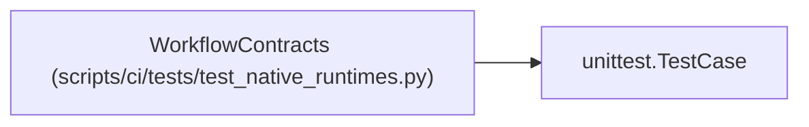

# WorkflowContracts

**Location:** `scripts/ci/tests/test_native_runtimes.py:24`
**Kind:** Class
**Bases:** `unittest.TestCase`
**Module:** [test_native_runtimes](../modules/test_native_runtimes.md)

## Description

_Auto-generated from `WorkflowContracts` in `scripts/ci/tests/test_native_runtimes.py`._

## Attributes

*No annotated attributes found.*

## Methods

| Method | Signature | Decorators | Description |
|--------|-----------|------------|-------------|
| `test_android_cleartext_is_restricted_to_debug_loopback_hosts` | `()` | — | — |
| `test_automatic_workflows_do_not_pull_or_build_images` | `()` | — | — |
| `test_deployment_acceptance_remains_explicit_and_checks_twice` | `()` | — | — |
| `test_all_workflow_and_composite_scripts_parse_as_bash` | `()` | — | — |

## Relationships

<!-- Auto-generated relationship summary. Do not edit by hand. -->

### Summary

| Module | Methods | Attributes |
|---|---:|---|
| [test_native_runtimes](../modules/test_native_runtimes.md) | 4 | — |

### Structure

| Kind | Entity | Module |
|---|---|---|
| Base | `unittest.TestCase` | — |
