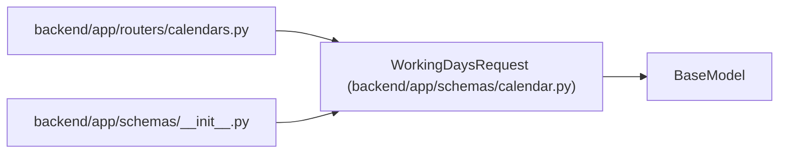

# WorkingDaysRequest

**Location:** `backend/app/schemas/calendar.py:69`
**Kind:** Pydantic model
**Bases:** `BaseModel`
**Module:** [schemas_calendar](../modules/schemas_calendar.md)

## Description

Request for calculating working days.

## Attributes

| Name | Type | Wire name | Required | Nullable | Default | Constraints | Examples | Description |
|------|------|-----------|----------|----------|---------|-------------|-------------|----------|
| `start_date` | `date` | `start_date` | Yes | No | — | — | — | — |
| `end_date` | `date` | `end_date` | Yes | No | — | — | — | — |

## Methods

*No public methods. Inherits from base classes.*

## Relationships

<!-- Auto-generated relationship summary. Do not edit by hand. -->

### Summary

| Module | Methods | Attributes |
|---|---:|---|
| [schemas_calendar](../modules/schemas_calendar.md) | 0 | `end_date`, `start_date` |

### Structure

| Kind | Entity | Module |
|---|---|---|
| Base | `BaseModel` | — |

### References

| Reference | Kind | Source | Call sites |
|---|---|---|---:|
| `calendars` | import | [calendars](../modules/calendars.md) | — |
| `__init__` | import | [schemas___init__](../modules/schemas___init__.md) | — |
