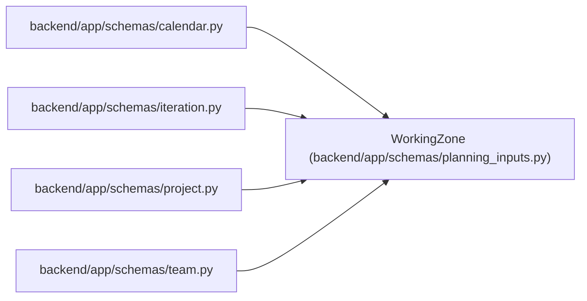

# WorkingZone

**Location:** `backend/app/schemas/planning_inputs.py:16`
**Kind:** Type alias
**Bases:** —
**Module:** [planning_inputs](../modules/planning_inputs.md)
**Target:** `Annotated[str, AfterValidator(validate_working_zone)]`

## Description

_Auto-generated from `WorkingZone` in `backend/app/schemas/planning_inputs.py`._

## Attributes

*No annotated attributes found.*

## Methods

*No public methods. Inherits from base classes.*

## Relationships

<!-- Auto-generated relationship summary. Do not edit by hand. -->

### Summary

| Module | Methods | Attributes |
|---|---:|---|
| [planning_inputs](../modules/planning_inputs.md) | 0 | — |

### References

| Reference | Kind | Source | Call sites |
|---|---|---|---:|
| `calendar` | import | [schemas_calendar](../modules/schemas_calendar.md) | — |
| `iteration` | import | [schemas_iteration](../modules/schemas_iteration.md) | — |
| `project` | import | [schemas_project](../modules/schemas_project.md) | — |
| `team` | import | [schemas_team](../modules/schemas_team.md) | — |
