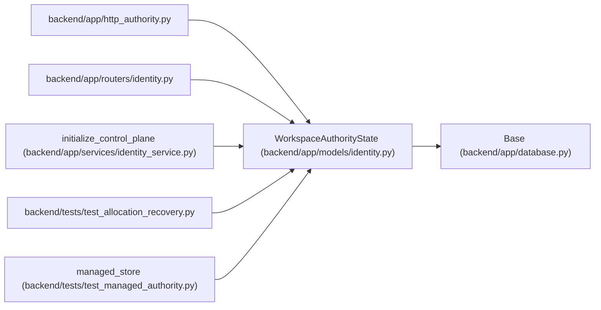

# WorkspaceAuthorityState

**Location:** `backend/app/models/identity.py:41`
**Kind:** Class
**Bases:** `Base`
**Module:** [models_identity](../modules/models_identity.md)

## Description

_Auto-generated from `WorkspaceAuthorityState` in `backend/app/models/identity.py`._

## Attributes

| Name | Type | Default | Description |
|------|------|---------|-------------|
| `id` | `Mapped[int]` | `mapped_column(Integer, primary_key=True)` | — |
| `bootstrap_principal_id` | `Mapped[int \| None]` | `mapped_column(ForeignKey('principals.id', ondelete='RESTRICT'))` | — |
| `operator_principal_id` | `Mapped[int \| None]` | `mapped_column(ForeignKey('principals.id', ondelete='RESTRICT'))` | — |

## Methods

*No public methods. Inherits from base classes.*

## Relationships

<!-- Auto-generated relationship summary. Do not edit by hand. -->

### Summary

| Module | Methods | Attributes |
|---|---:|---|
| [models_identity](../modules/models_identity.md) | 0 | `bootstrap_principal_id`, `id`, `operator_principal_id` |

### Structure

| Kind | Entity | Module |
|---|---|---|
| Base | `Base` | [app_database](../modules/app_database.md) |

### References

| Reference | Kind | Source | Call sites |
|---|---|---|---:|
| `http_authority` | import | [http_authority](../modules/http_authority.md) | — |
| `identity` | import | [routers_identity](../modules/routers_identity.md) | — |
| `initialize_control_plane` | call | [identity_service](../modules/identity_service.md) | 1 |
| `test_allocation_recovery` | import | [test_allocation_recovery](../modules/test_allocation_recovery.md) | — |
| `managed_store` | call | [test_managed_authority](../modules/test_managed_authority.md) | 1 |
