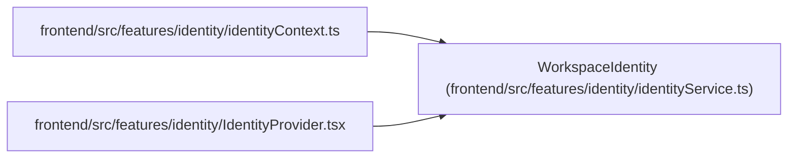

# WorkspaceIdentity

**Location:** `frontend/src/features/identity/identityService.ts:3`
**Kind:** Class
**Bases:** —
**Module:** [identityService](../modules/identityService.md)

## Description

_Auto-generated from `WorkspaceIdentity` in `frontend/src/features/identity/identityService.ts`._

## Attributes

| Name | Type | Default | Description |
|------|------|---------|-------------|
| `mode` | `'managed' \| 'trusted_local'` | *required* | — |
| `authenticated` | `boolean` | *required* | — |
| `configured` | `boolean` | *required* | — |
| `principal` | `{ id: number; kind: 'human' \| 'agent' \| 'system'; display_name: string } \| null` | *required* | — |
| `profile` | `{ id: number; display_name: string } \| null` | *required* | — |
| `workspace_role` | `'owner' \| 'operator' \| 'member' \| null` | *required* | — |
| `projects` | `Record<string, string>` | *required* | — |
| `csrf_token` | `string \| null` | *required* | — |
| `authentication_error` | `string \| null` | *required* | — |

## Methods

*No public methods. Inherits from base classes.*

## Relationships

<!-- Auto-generated relationship summary. Do not edit by hand. -->

### Summary

| Module | Methods | Attributes |
|---|---:|---|
| [identityService](../modules/identityService.md) | 0 | `authenticated`, `authentication_error`, `configured`, `csrf_token`, `mode`, `principal`, `profile`, `projects`, `workspace_role` |

### References

| Reference | Kind | Source | Call sites |
|---|---|---|---:|
| `identityContext` | import | [identityContext](../modules/identityContext.md) | — |
| `IdentityProvider` | import | [IdentityProvider](../modules/IdentityProvider.md) | — |
