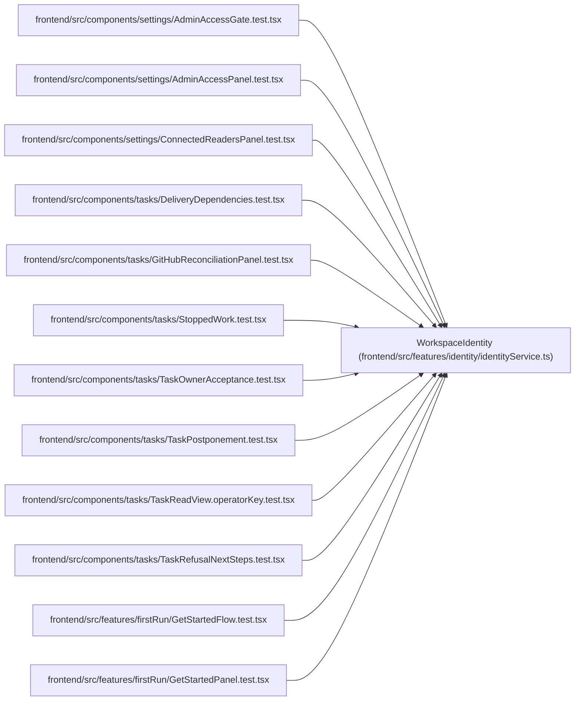

# WorkspaceIdentity

**Location:** `frontend/src/features/identity/identityService.ts:6`
**Kind:** Interface
**Bases:** —
**Module:** [identityService](../modules/identityService.md)

## Description

_Auto-generated from `WorkspaceIdentity` in `frontend/src/features/identity/identityService.ts`._

## Attributes

| Name | Type | Required | Default | Description |
|------|------|----------|---------|-------------|
| `mode` | `'managed' \| 'trusted_local'` | Yes | — | — |
| `authenticated` | `boolean` | Yes | — | — |
| `configured` | `boolean` | Yes | — | — |
| `principal` | `{ id: number; kind: 'human' \| 'agent' \| 'system'; display_name: string } \| null` | Yes | — | — |
| `profile` | `WorkProfile \| null` | Yes | — | — |
| `workspace_role` | `'owner' \| 'operator' \| 'member' \| null` | Yes | — | — |
| `projects` | `Record<string, string>` | Yes | — | — |
| `csrf_token` | `string \| null` | Yes | — | — |
| `authentication_error` | `string \| null` | No | — | — |
| `access` | `'full' \| 'observe' \| null` | No | — | — |
| `observer` | `{ client_label: string \| null; expires_at: string; renewable_until: string } \| null` | No | — | — |
| `features` | `string[]` | No | — | — |

## Methods

*No declared methods.*

## Relationships

<!-- Auto-generated relationship summary. Do not edit by hand. -->

```mermaid
flowchart LR
    n0["WorkspaceIdentity (frontend/src/features/identity/identityService.ts)"]
    n1["frontend/src/components/settings/AdminAccessGate.test.tsx"]
    n2["frontend/src/components/settings/AdminAccessPanel.test.tsx"]
    n3["frontend/src/components/settings/ConnectedReadersPanel.test.tsx"]
    n4["frontend/src/components/tasks/DeliveryDependencies.test.tsx"]
    n5["frontend/src/components/tasks/GitHubReconciliationPanel.test.tsx"]
    n6["frontend/src/components/tasks/StoppedWork.test.tsx"]
    n7["frontend/src/components/tasks/TaskOwnerAcceptance.test.tsx"]
    n8["frontend/src/components/tasks/TaskPostponement.test.tsx"]
    n9["frontend/src/components/tasks/TaskReadView.operatorKey.test.tsx"]
    n10["frontend/src/components/tasks/TaskRefusalNextSteps.test.tsx"]
    n11["frontend/src/features/firstRun/GetStartedFlow.test.tsx"]
    n12["frontend/src/features/firstRun/GetStartedPanel.test.tsx"]
    n1 --> n0
    n2 --> n0
    n3 --> n0
    n4 --> n0
    n5 --> n0
    n6 --> n0
    n7 --> n0
    n8 --> n0
    n9 --> n0
    n10 --> n0
    n11 --> n0
    n12 --> n0
    click n0 "../modules/identityService.md"
    click n1 "../modules/AdminAccessGate.test.md"
    click n2 "../modules/AdminAccessPanel.test.md"
    click n3 "../modules/ConnectedReadersPanel.test.md"
    click n4 "../modules/DeliveryDependencies.test.md"
    click n5 "../modules/GitHubReconciliationPanel.test.md"
    click n6 "../modules/StoppedWork.test.md"
    click n7 "../modules/TaskOwnerAcceptance.test.md"
    click n8 "../modules/TaskPostponement.test.md"
    click n9 "../modules/TaskReadView.operatorKey.test.md"
    click n10 "../modules/TaskRefusalNextSteps.test.md"
    click n11 "../modules/GetStartedFlow.test.md"
    click n12 "../modules/GetStartedPanel.test.md"
```

### Summary

| Module | Methods | Attributes |
|---|---:|---|
| [identityService](../modules/identityService.md) | 0 | `access`, `authenticated`, `authentication_error`, `configured`, `csrf_token`, `features`, `mode`, `observer`, `principal`, `profile`, `projects`, `workspace_role` |

### References

| Reference | Kind | Source | Call sites |
|---|---|---|---:|
| `AdminAccessGate.test` | import | [AdminAccessGate.test](../modules/AdminAccessGate.test.md) | — |
| `AdminAccessPanel.test` | import | [AdminAccessPanel.test](../modules/AdminAccessPanel.test.md) | — |
| `ConnectedReadersPanel.test` | import | [ConnectedReadersPanel.test](../modules/ConnectedReadersPanel.test.md) | — |
| `DeliveryDependencies.test` | import | [DeliveryDependencies.test](../modules/DeliveryDependencies.test.md) | — |
| `GitHubReconciliationPanel.test` | import | [GitHubReconciliationPanel.test](../modules/GitHubReconciliationPanel.test.md) | — |
| `StoppedWork.test` | import | [StoppedWork.test](../modules/StoppedWork.test.md) | — |
| `TaskOwnerAcceptance.test` | import | [TaskOwnerAcceptance.test](../modules/TaskOwnerAcceptance.test.md) | — |
| `TaskPostponement.test` | import | [TaskPostponement.test](../modules/TaskPostponement.test.md) | — |
| `TaskReadView.operatorKey.test` | import | [TaskReadView.operatorKey.test](../modules/TaskReadView.operatorKey.test.md) | — |
| `TaskRefusalNextSteps.test` | import | [TaskRefusalNextSteps.test](../modules/TaskRefusalNextSteps.test.md) | — |
| `GetStartedFlow.test` | import | [GetStartedFlow.test](../modules/GetStartedFlow.test.md) | — |
| `GetStartedPanel.test` | import | [GetStartedPanel.test](../modules/GetStartedPanel.test.md) | — |

> References: showing 12 of 19 logical references; 7 omitted by the 12-row generated summary limit.
