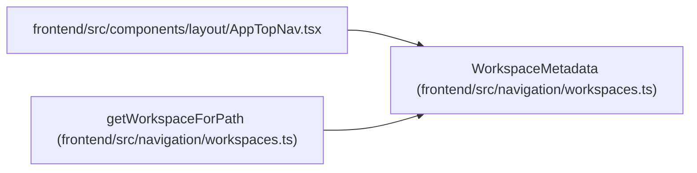

# WorkspaceMetadata

**Location:** `frontend/src/navigation/workspaces.ts:29`
**Kind:** Class
**Bases:** —
**Module:** [workspaces](../modules/workspaces.md)

## Description

_Auto-generated from `WorkspaceMetadata` in `frontend/src/navigation/workspaces.ts`._

## Attributes

| Name | Type | Default | Description |
|------|------|---------|-------------|
| `key` | `WorkspaceKey` | *required* | — |
| `labelKey` | `string` | *required* | — |
| `defaultLabel` | `string` | *required* | — |
| `descriptionKey` | `string` | *required* | — |
| `defaultDescription` | `string` | *required* | — |
| `icon` | `LucideIcon` | *required* | — |
| `defaultPath` | `string` | *required* | — |
| `items` | `NavItem[]` | *required* | — |

## Methods

*No public methods. Inherits from base classes.*

## Relationships

<!-- Auto-generated relationship summary. Do not edit by hand. -->

### Summary

| Module | Methods | Attributes |
|---|---:|---|
| [workspaces](../modules/workspaces.md) | 0 | `defaultDescription`, `defaultLabel`, `defaultPath`, `descriptionKey`, `icon`, `items`, `key`, `labelKey` |

### References

| Reference | Kind | Source | Call sites |
|---|---|---|---:|
| `AppTopNav` | import | [AppTopNav](../modules/AppTopNav.md) | — |
| `getWorkspaceForPath` | type_reference | [workspaces](../modules/workspaces.md) | — |
