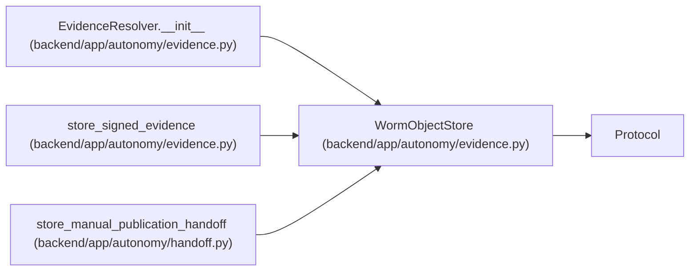

# WormObjectStore

**Location:** `backend/app/autonomy/evidence.py:111`
**Kind:** Class
**Bases:** `Protocol`
**Module:** [evidence](../modules/evidence.md)

**Decorators:** `@runtime_checkable`

## Description

Charter-selected immutable store; implementations must enforce WORM.

## Attributes

*No annotated attributes found.*

## Methods

| Method | Signature | Decorators | Description |
|--------|-----------|------------|-------------|
| `put_if_absent` | `(*, object_key: str, payload: bytes, redaction_class: RedactionClass) -> None` | — | — |
| `get` | `(*, object_key: str) -> bytes` | — | — |
| `ordered_keys` | `(*, prefix: str) -> tuple[str, ...]` | — | — |

## Relationships

<!-- Auto-generated relationship summary. Do not edit by hand. -->

### Summary

| Module | Methods | Attributes |
|---|---:|---|
| [evidence](../modules/evidence.md) | 3 | — |

### Structure

| Kind | Entity | Module |
|---|---|---|
| Base | `Protocol` | — |

### References

| Reference | Kind | Source | Call sites |
|---|---|---|---:|
| `EvidenceResolver.__init__` | type_reference | [evidence](../modules/evidence.md) | — |
| `store_signed_evidence` | type_reference | [evidence](../modules/evidence.md) | — |
| `store_manual_publication_handoff` | type_reference | [handoff](../modules/handoff.md) | — |
