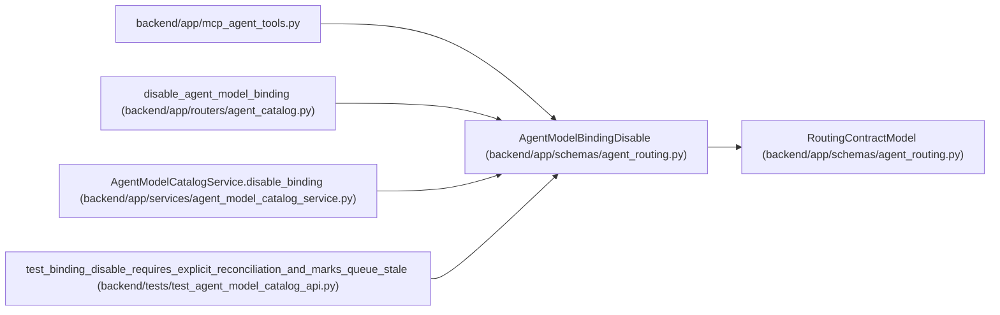

# AgentModelBindingDisable

**Location:** `backend/app/schemas/agent_routing.py:466`
**Kind:** Pydantic model
**Bases:** `RoutingContractModel`
**Module:** [agent_routing](../modules/agent_routing.md)

## Description

Optimistic soft-disable command for an actor-model binding.

## Attributes

| Name | Type | Wire name | Required | Nullable | Default | Constraints | Examples | Description |
|------|------|-----------|----------|----------|---------|-------------|-------------|----------|
| `expected_revision` | `PositiveRevision` | `expected_revision` | Yes | No | — | — | — | — |
| `reconcile_live_assignments` | `bool` | `reconcile_live_assignments` | No | No | `False` | — | — | — |

## Methods

*No public methods. Inherits from base classes.*

## Relationships

<!-- Auto-generated relationship summary. Do not edit by hand. -->

### Summary

| Module | Methods | Attributes |
|---|---:|---|
| [agent_routing](../modules/agent_routing.md) | 0 | `expected_revision`, `reconcile_live_assignments` |

### Structure

| Kind | Entity | Module |
|---|---|---|
| Base | `RoutingContractModel` | [agent_routing](../modules/agent_routing.md) |

### References

| Reference | Kind | Source | Call sites |
|---|---|---|---:|
| `mcp_agent_tools` | import | [mcp_agent_tools](../modules/mcp_agent_tools.md) | — |
| `disable_agent_model_binding` | type_reference | [agent_catalog](../modules/agent_catalog.md) | — |
| `AgentModelCatalogService.disable_binding` | type_reference | [agent_model_catalog_service](../modules/agent_model_catalog_service.md) | — |
| `test_binding_disable_requires_explicit_reconciliation_and_marks_queue_stale` | call | [test_agent_model_catalog_api](../modules/test_agent_model_catalog_api.md) | 2 |
