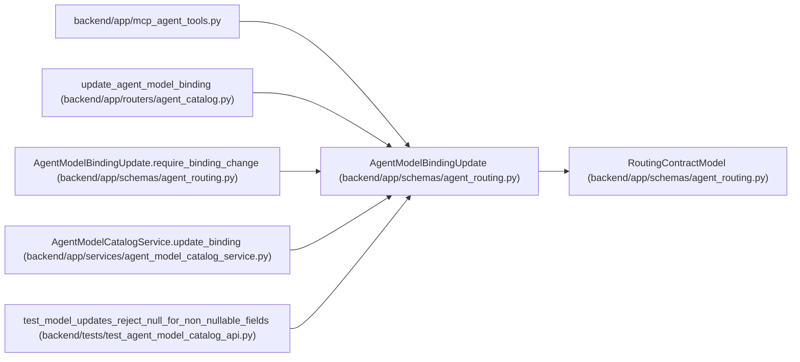

# AgentModelBindingUpdate

**Location:** `backend/app/schemas/agent_routing.py:407`
**Kind:** Pydantic model
**Bases:** `RoutingContractModel`
**Module:** [agent_routing](../modules/agent_routing.md)

## Description

Optimistic partial update for one actor-model binding.

## Validators

| Method | Scope | Fields | Mode | Options |
|--------|-------|--------|------|---------|
| `validate_tool_tags` | field | tool_tags | after | — |
| `validate_data_policy_tags` | field | data_policy_tags | after | — |
| `require_binding_change` | model | — | after | — |

## Attributes

| Name | Type | Wire name | Required | Nullable | Default | Constraints | Examples | Description |
|------|------|-----------|----------|----------|---------|-------------|-------------|----------|
| `expected_revision` | `PositiveRevision` | `expected_revision` | Yes | No | — | — | — | — |
| `is_default` | `bool \| None` | `is_default` | No | Yes | `None` | — | — | — |
| `enabled` | `Literal[True] \| None` | `enabled` | No | Yes | `None` | — | — | — |
| `tool_tags` | `list[str] \| None` | `tool_tags` | No | Yes | `None` | — | — | — |
| `data_policy_tags` | `list[str] \| None` | `data_policy_tags` | No | Yes | `None` | — | — | — |
| `reconcile_live_assignments` | `bool` | `reconcile_live_assignments` | No | No | `False` | — | — | — |

## Methods

| Method | Signature | Decorators | Description |
|--------|-----------|------------|-------------|
| `validate_tool_tags` | `(value: list[str] \| None) -> list[str] \| None` | `@field_validator('tool_tags')`, `@classmethod` | — |
| `validate_data_policy_tags` | `(value: list[str] \| None) -> list[str] \| None` | `@field_validator('data_policy_tags')`, `@classmethod` | — |
| `require_binding_change` | `() -> 'AgentModelBindingUpdate'` | `@model_validator(mode='after')` | — |

## Relationships

<!-- Auto-generated relationship summary. Do not edit by hand. -->

### Summary

| Module | Methods | Attributes |
|---|---:|---|
| [agent_routing](../modules/agent_routing.md) | 3 | `data_policy_tags`, `enabled`, `expected_revision`, `is_default`, `reconcile_live_assignments`, `tool_tags` |

### Structure

| Kind | Entity | Module |
|---|---|---|
| Base | `RoutingContractModel` | [agent_routing](../modules/agent_routing.md) |

### References

| Reference | Kind | Source | Call sites |
|---|---|---|---:|
| `mcp_agent_tools` | import | [mcp_agent_tools](../modules/mcp_agent_tools.md) | — |
| `update_agent_model_binding` | type_reference | [agent_catalog](../modules/agent_catalog.md) | — |
| `AgentModelBindingUpdate.require_binding_change` | type_reference | [agent_routing](../modules/agent_routing.md) | — |
| `AgentModelCatalogService.update_binding` | type_reference | [agent_model_catalog_service](../modules/agent_model_catalog_service.md) | — |
| `test_model_updates_reject_null_for_non_nullable_fields` | type_reference | [test_agent_model_catalog_api](../modules/test_agent_model_catalog_api.md) | — |
