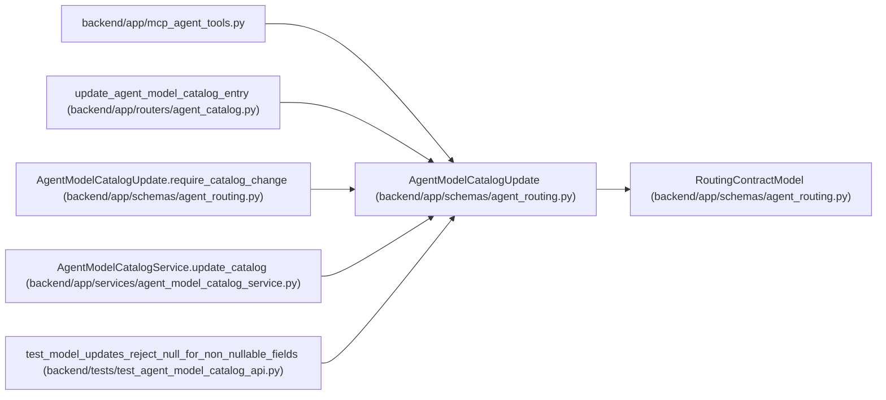

# AgentModelCatalogUpdate

**Location:** `backend/app/schemas/agent_routing.py:278`
**Kind:** Pydantic model
**Bases:** `RoutingContractModel`
**Module:** [agent_routing](../modules/agent_routing.md)

## Description

Optimistic partial update for one catalog entry.

## Validators

| Method | Scope | Fields | Mode | Options |
|--------|-------|--------|------|---------|
| `require_integer_reasoning_tier` | field | reasoning_tier | before | — |
| `strip_optional_text` | field | provider, configured_model_alias | after | — |
| `validate_modality_tags` | field | modality_tags | after | — |
| `require_catalog_change` | model | — | after | — |

## Attributes

| Name | Type | Wire name | Required | Nullable | Default | Constraints | Examples | Description |
|------|------|-----------|----------|----------|---------|-------------|-------------|----------|
| `expected_revision` | `PositiveRevision` | `expected_revision` | Yes | No | — | — | — | — |
| `provider` | `str \| None` | `provider` | No | Yes | `None` | min_length=1; max_length=120 | — | — |
| `configured_model_alias` | `str \| None` | `configured_model_alias` | No | Yes | `None` | min_length=1; max_length=255 | — | — |
| `reasoning_tier` | `ReasoningTier \| None` | `reasoning_tier` | No | Yes | `None` | — | — | — |
| `context_tier` | `ModelContextTier \| None` | `context_tier` | No | Yes | `None` | — | — | — |
| `modality_tags` | `list[str] \| None` | `modality_tags` | No | Yes | `None` | — | — | — |
| `cost_tier` | `ModelCostTier \| None` | `cost_tier` | No | Yes | `None` | — | — | — |
| `latency_tier` | `ModelLatencyTier \| None` | `latency_tier` | No | Yes | `None` | — | — | — |
| `enabled` | `Literal[True] \| None` | `enabled` | No | Yes | `None` | — | — | — |
| `last_verified_at` | `datetime \| None` | `last_verified_at` | No | Yes | `None` | — | — | — |
| `reconcile_live_assignments` | `bool` | `reconcile_live_assignments` | No | No | `False` | — | — | — |

## Methods

| Method | Signature | Decorators | Description |
|--------|-----------|------------|-------------|
| `require_integer_reasoning_tier` | `(value: Any) -> Any` | `@field_validator('reasoning_tier', mode='before')`, `@classmethod` | — |
| `strip_optional_text` | `(value: str \| None) -> str \| None` | `@field_validator('provider', 'configured_model_alias')`, `@classmethod` | — |
| `validate_modality_tags` | `(value: list[str] \| None) -> list[str] \| None` | `@field_validator('modality_tags')`, `@classmethod` | — |
| `require_catalog_change` | `() -> 'AgentModelCatalogUpdate'` | `@model_validator(mode='after')` | — |

## Relationships

<!-- Auto-generated relationship summary. Do not edit by hand. -->

### Summary

| Module | Methods | Attributes |
|---|---:|---|
| [agent_routing](../modules/agent_routing.md) | 4 | `configured_model_alias`, `context_tier`, `cost_tier`, `enabled`, `expected_revision`, `last_verified_at`, `latency_tier`, `modality_tags`, `provider`, `reasoning_tier`, `reconcile_live_assignments` |

### Structure

| Kind | Entity | Module |
|---|---|---|
| Base | `RoutingContractModel` | [agent_routing](../modules/agent_routing.md) |

### References

| Reference | Kind | Source | Call sites |
|---|---|---|---:|
| `mcp_agent_tools` | import | [mcp_agent_tools](../modules/mcp_agent_tools.md) | — |
| `update_agent_model_catalog_entry` | type_reference | [agent_catalog](../modules/agent_catalog.md) | — |
| `AgentModelCatalogUpdate.require_catalog_change` | type_reference | [agent_routing](../modules/agent_routing.md) | — |
| `AgentModelCatalogService.update_catalog` | type_reference | [agent_model_catalog_service](../modules/agent_model_catalog_service.md) | — |
| `test_model_updates_reject_null_for_non_nullable_fields` | type_reference | [test_agent_model_catalog_api](../modules/test_agent_model_catalog_api.md) | — |
