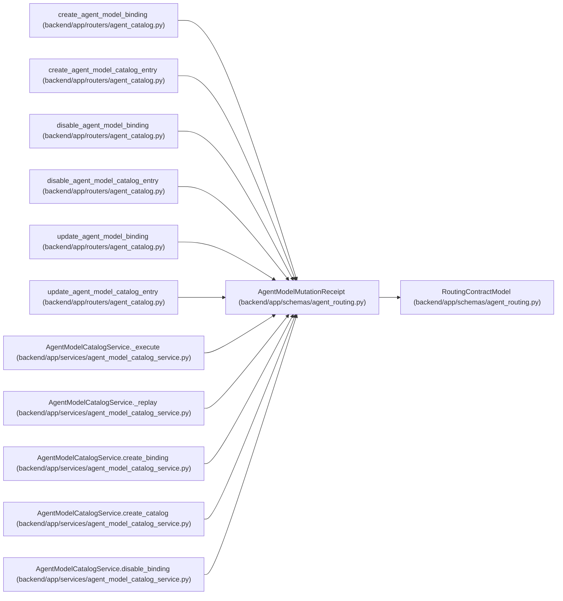

# AgentModelMutationReceipt

**Location:** `backend/app/schemas/agent_routing.py:487`
**Kind:** Pydantic model
**Bases:** `RoutingContractModel`
**Module:** [agent_routing](../modules/agent_routing.md)

## Description

Durable, replay-safe receipt for an operator model mutation.

## Attributes

| Name | Type | Wire name | Required | Nullable | Default | Constraints | Examples | Description |
|------|------|-----------|----------|----------|---------|-------------|-------------|----------|
| `operation` | `str` | `operation` | Yes | No | — | max_length=100; min_length=1 | — | — |
| `actor_id` | `int` | `actor_id` | Yes | No | — | ge=1 | — | — |
| `target_type` | `Literal['model_catalog', 'model_binding']` | `target_type` | Yes | No | — | — | — | — |
| `target_id` | `int` | `target_id` | Yes | No | — | ge=1 | — | — |
| `idempotency_key` | `str` | `idempotency_key` | Yes | No | — | max_length=255; min_length=1 | — | — |
| `rationale` | `str` | `rationale` | Yes | No | — | max_length=2000; min_length=1 | — | — |
| `correlation_id` | `str` | `correlation_id` | Yes | No | — | max_length=255; min_length=1 | — | — |
| `authoritative_revision` | `PositiveRevision` | `authoritative_revision` | Yes | No | — | — | — | — |
| `invalidated_assignment_ids` | `list[int]` | `invalidated_assignment_ids` | No | No | factory: `list` | — | — | — |
| `audit_event_ids` | `list[int]` | `audit_event_ids` | No | No | factory: `list` | — | — | — |
| `result` | `dict[str, Any]` | `result` | Yes | No | — | — | — | — |

## Methods

*No public methods. Inherits from base classes.*

## Relationships

<!-- Auto-generated relationship summary. Do not edit by hand. -->

### Summary

| Module | Methods | Attributes |
|---|---:|---|
| [agent_routing](../modules/agent_routing.md) | 0 | `actor_id`, `audit_event_ids`, `authoritative_revision`, `correlation_id`, `idempotency_key`, `invalidated_assignment_ids`, `operation`, `rationale`, `result`, `target_id`, `target_type` |

### Structure

| Kind | Entity | Module |
|---|---|---|
| Base | `RoutingContractModel` | [agent_routing](../modules/agent_routing.md) |

### References

| Reference | Kind | Source | Call sites |
|---|---|---|---:|
| `create_agent_model_binding` | type_reference | [agent_catalog](../modules/agent_catalog.md) | — |
| `create_agent_model_catalog_entry` | type_reference | [agent_catalog](../modules/agent_catalog.md) | — |
| `disable_agent_model_binding` | type_reference | [agent_catalog](../modules/agent_catalog.md) | — |
| `disable_agent_model_catalog_entry` | type_reference | [agent_catalog](../modules/agent_catalog.md) | — |
| `update_agent_model_binding` | type_reference | [agent_catalog](../modules/agent_catalog.md) | — |
| `update_agent_model_catalog_entry` | type_reference | [agent_catalog](../modules/agent_catalog.md) | — |
| `AgentModelCatalogService._execute` | call | [agent_model_catalog_service](../modules/agent_model_catalog_service.md) | 1 |
| `AgentModelCatalogService._execute` | type_reference | [agent_model_catalog_service](../modules/agent_model_catalog_service.md) | — |
| `AgentModelCatalogService._replay` | type_reference | [agent_model_catalog_service](../modules/agent_model_catalog_service.md) | — |
| `AgentModelCatalogService.create_binding` | type_reference | [agent_model_catalog_service](../modules/agent_model_catalog_service.md) | — |
| `AgentModelCatalogService.create_catalog` | type_reference | [agent_model_catalog_service](../modules/agent_model_catalog_service.md) | — |
| `AgentModelCatalogService.disable_binding` | type_reference | [agent_model_catalog_service](../modules/agent_model_catalog_service.md) | — |

> References: showing 12 of 15 logical references; 3 omitted by the 12-row generated summary limit.
