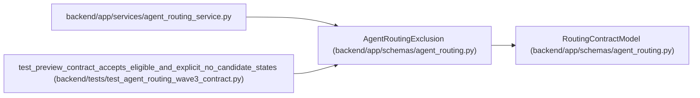

# AgentRoutingExclusion

**Location:** `backend/app/schemas/agent_routing.py:1005`
**Kind:** Pydantic model
**Bases:** `RoutingContractModel`
**Module:** [agent_routing](../modules/agent_routing.md)

## Description

Bounded reason evidence for one ineligible actor/binding pair.

## Validators

| Method | Scope | Fields | Mode | Options |
|--------|-------|--------|------|---------|
| `validate_blocker_codes` | field | hard_blocker_codes | before | — |
| `validate_matched_skills` | field | matched_skill_levels | before | — |
| `validate_skill_keys` | field | missing_skill_keys, insufficient_skill_keys, blocking_weakness_keys | before | — |
| `validate_missing_tags` | field | missing_modality_tags, missing_tool_tags, missing_data_policy_tags | after | — |
| `strip_optional_exclusion_text` | field | profile_revision, configured_model_alias, rationale | after | — |

## Attributes

| Name | Type | Wire name | Required | Nullable | Default | Constraints | Examples | Description |
|------|------|-----------|----------|----------|---------|-------------|-------------|----------|
| `actor_id` | `int` | `actor_id` | Yes | No | — | ge=1; strict=True | — | — |
| `actor_revision` | `PositiveRevision` | `actor_revision` | Yes | No | — | — | — | — |
| `actor_queue_revision` | `PositiveRevision` | `actor_queue_revision` | Yes | No | — | — | — | — |
| `profile_id` | `int \| None` | `profile_id` | No | Yes | `None` | ge=1; strict=True | — | — |
| `profile_revision` | `str \| None` | `profile_revision` | No | Yes | `None` | max_length=120; min_length=1 | — | — |
| `capacity_owner_id` | `int \| None` | `capacity_owner_id` | No | Yes | `None` | ge=1; strict=True | — | — |
| `capacity_owner_profile_id` | `int \| None` | `capacity_owner_profile_id` | No | Yes | `None` | ge=1; strict=True | — | — |
| `model_binding_id` | `int \| None` | `model_binding_id` | No | Yes | `None` | ge=1; strict=True | — | — |
| `model_binding_revision` | `PositiveRevision \| None` | `model_binding_revision` | No | Yes | `None` | — | — | — |
| `model_catalog_id` | `int \| None` | `model_catalog_id` | No | Yes | `None` | ge=1; strict=True | — | — |
| `model_catalog_key` | `RoutingKey \| None` | `model_catalog_key` | No | Yes | `None` | — | — | — |
| `model_catalog_revision` | `PositiveRevision \| None` | `model_catalog_revision` | No | Yes | `None` | — | — | — |
| `configured_model_alias` | `str \| None` | `configured_model_alias` | No | Yes | `None` | max_length=255; min_length=1 | — | — |
| `eligible` | `Literal[False]` | `eligible` | No | No | `False` | — | — | — |
| `hard_blocker_codes` | `list[RoutingBlockerCode]` | `hard_blocker_codes` | Yes | No | — | min_length=1; max_length=unknown (len(RoutingBlockerCode)) | — | — |
| `matched_skill_levels` | `dict[str, SkillLevel]` | `matched_skill_levels` | No | No | factory: `dict` | — | — | — |
| `missing_skill_keys` | `list[RoutingKey]` | `missing_skill_keys` | No | No | factory: `list` | — | — | — |
| `insufficient_skill_keys` | `list[RoutingKey]` | `insufficient_skill_keys` | No | No | factory: `list` | — | — | — |
| `blocking_weakness_keys` | `list[RoutingKey]` | `blocking_weakness_keys` | No | No | factory: `list` | — | — | — |
| `reasoning_tier` | `ReasoningTier \| None` | `reasoning_tier` | No | Yes | `None` | — | — | — |
| `context_tier` | `ModelContextTier \| None` | `context_tier` | No | Yes | `None` | — | — | — |
| `cost_tier` | `ModelCostTier \| None` | `cost_tier` | No | Yes | `None` | — | — | — |
| `latency_tier` | `ModelLatencyTier \| None` | `latency_tier` | No | Yes | `None` | — | — | — |
| `missing_modality_tags` | `list[str]` | `missing_modality_tags` | No | No | factory: `list` | — | — | — |
| `missing_tool_tags` | `list[str]` | `missing_tool_tags` | No | No | factory: `list` | — | — | — |
| `missing_data_policy_tags` | `list[str]` | `missing_data_policy_tags` | No | No | factory: `list` | — | — | — |
| `available_capacity_days` | `float \| None` | `available_capacity_days` | No | Yes | `None` | — | — | — |
| `committed_effort_days` | `float \| None` | `committed_effort_days` | No | Yes | `None` | ge=0 | — | — |
| `workload_ratio` | `float \| None` | `workload_ratio` | No | Yes | `None` | ge=0 | — | — |
| `vacation_conflict` | `bool \| None` | `vacation_conflict` | No | Yes | `None` | — | — | — |
| `queued_assignments` | `int \| None` | `queued_assignments` | No | Yes | `None` | ge=0; strict=True | — | — |
| `accepted_assignments` | `int \| None` | `accepted_assignments` | No | Yes | `None` | ge=0; strict=True | — | — |
| `running_runs` | `int \| None` | `running_runs` | No | Yes | `None` | ge=0; strict=True | — | — |
| `schedule_delay_days` | `float \| None` | `schedule_delay_days` | No | Yes | `None` | ge=0 | — | — |
| `schedule_eligible` | `bool \| None` | `schedule_eligible` | No | Yes | `None` | — | — | — |
| `rationale` | `str` | `rationale` | Yes | No | — | max_length=2000; min_length=1 | — | — |

## Methods

| Method | Signature | Decorators | Description |
|--------|-----------|------------|-------------|
| `validate_blocker_codes` | `(value: Any) -> Any` | `@field_validator('hard_blocker_codes', mode='before')`, `@classmethod` | — |
| `validate_matched_skills` | `(value: Any) -> Any` | `@field_validator('matched_skill_levels', mode='before')`, `@classmethod` | — |
| `validate_skill_keys` | `(value: Any, info: Any) -> Any` | `@field_validator('missing_skill_keys', 'insufficient_skill_keys', 'blocking_weakness_keys', mode='before')`, `@classmethod` | — |
| `validate_missing_tags` | `(value: list[str], info: Any) -> list[str]` | `@field_validator('missing_modality_tags', 'missing_tool_tags', 'missing_data_policy_tags')`, `@classmethod` | — |
| `strip_optional_exclusion_text` | `(value: str \| None) -> str \| None` | `@field_validator('profile_revision', 'configured_model_alias', 'rationale')`, `@classmethod` | — |

## Relationships

<!-- Auto-generated relationship summary. Do not edit by hand. -->

### Summary

| Module | Methods | Attributes |
|---|---:|---|
| [agent_routing](../modules/agent_routing.md) | 5 | `accepted_assignments`, `actor_id`, `actor_queue_revision`, `actor_revision`, `available_capacity_days`, `blocking_weakness_keys`, `capacity_owner_id`, `capacity_owner_profile_id`, `committed_effort_days`, `configured_model_alias`, `context_tier`, `cost_tier` |

### Structure

| Kind | Entity | Module |
|---|---|---|
| Base | `RoutingContractModel` | [agent_routing](../modules/agent_routing.md) |

### References

| Reference | Kind | Source | Call sites |
|---|---|---|---:|
| `agent_routing_service` | import | [agent_routing_service](../modules/agent_routing_service.md) | — |
| `test_preview_contract_accepts_eligible_and_explicit_no_candidate_states` | call | [test_agent_routing_wave3_contract](../modules/test_agent_routing_wave3_contract.md) | 1 |
