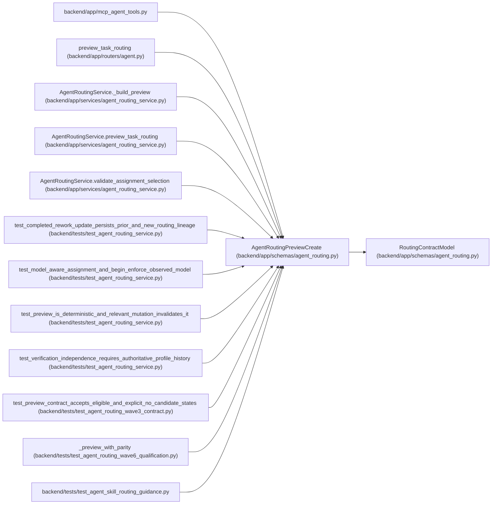

# AgentRoutingPreviewCreate

**Location:** `backend/app/schemas/agent_routing.py:917`
**Kind:** Pydantic model
**Bases:** `RoutingContractModel`
**Module:** [agent_routing](../modules/agent_routing.md)

## Description

Non-dispatching exact-actor preview bound to current task state.

## Attributes

| Name | Type | Wire name | Required | Nullable | Default | Constraints | Examples | Description |
|------|------|-----------|----------|----------|---------|-------------|-------------|----------|
| `purpose` | `Literal['execution', 'verification']` | `purpose` | Yes | No | — | — | — | — |
| `assessment_id` | `int` | `assessment_id` | Yes | No | — | strict=True; ge=1 | — | — |
| `expected_task_version` | `int` | `expected_task_version` | Yes | No | — | strict=True; ge=1 | — | — |
| `reviewer_profile_id` | `int \| None` | `reviewer_profile_id` | No | Yes | `None` | strict=True; ge=1 | — | — |

## Methods

*No public methods. Inherits from base classes.*

## Relationships

<!-- Auto-generated relationship summary. Do not edit by hand. -->

### Summary

| Module | Methods | Attributes |
|---|---:|---|
| [agent_routing](../modules/agent_routing.md) | 0 | `assessment_id`, `expected_task_version`, `purpose`, `reviewer_profile_id` |

### Structure

| Kind | Entity | Module |
|---|---|---|
| Base | `RoutingContractModel` | [agent_routing](../modules/agent_routing.md) |

### References

| Reference | Kind | Source | Call sites |
|---|---|---|---:|
| `mcp_agent_tools` | import | [mcp_agent_tools](../modules/mcp_agent_tools.md) | — |
| `preview_task_routing` | type_reference | [routers_agent](../modules/routers_agent.md) | — |
| `AgentRoutingService._build_preview` | type_reference | [agent_routing_service](../modules/agent_routing_service.md) | — |
| `AgentRoutingService.preview_task_routing` | type_reference | [agent_routing_service](../modules/agent_routing_service.md) | — |
| `AgentRoutingService.validate_assignment_selection` | call | [agent_routing_service](../modules/agent_routing_service.md) | 1 |
| `test_completed_rework_update_persists_prior_and_new_routing_lineage` | call | [test_agent_routing_service](../modules/test_agent_routing_service.md) | 1 |
| `test_model_aware_assignment_and_begin_enforce_observed_model` | call | [test_agent_routing_service](../modules/test_agent_routing_service.md) | 1 |
| `test_preview_is_deterministic_and_relevant_mutation_invalidates_it` | call | [test_agent_routing_service](../modules/test_agent_routing_service.md) | 1 |
| `test_verification_independence_requires_authoritative_profile_history` | call | [test_agent_routing_service](../modules/test_agent_routing_service.md) | 1 |
| `test_preview_contract_accepts_eligible_and_explicit_no_candidate_states` | call | [test_agent_routing_wave3_contract](../modules/test_agent_routing_wave3_contract.md) | 1 |
| `_preview_with_parity` | call | [test_agent_routing_wave6_qualification](../modules/test_agent_routing_wave6_qualification.md) | 1 |
| `test_agent_skill_routing_guidance` | import | [test_agent_skill_routing_guidance](../modules/test_agent_skill_routing_guidance.md) | — |
