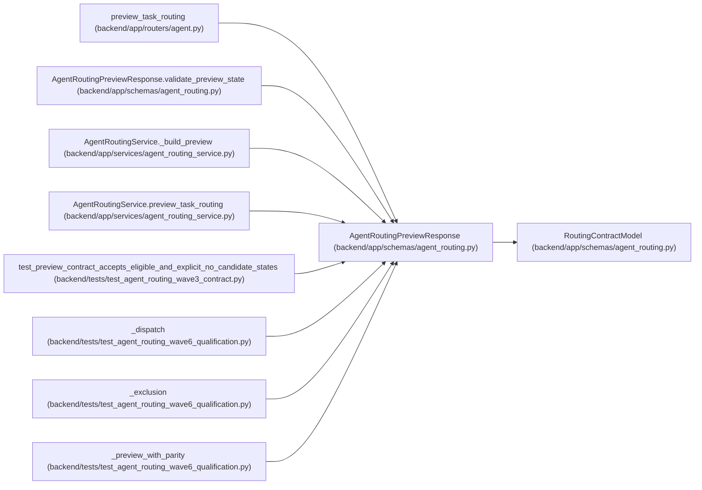

# AgentRoutingPreviewResponse

**Location:** `backend/app/schemas/agent_routing.py:1123`
**Kind:** Pydantic model
**Bases:** `RoutingContractModel`
**Module:** [agent_routing](../modules/agent_routing.md)

## Description

Expiring non-dispatch result over a digest-bound routing input snapshot.

## Validators

| Method | Scope | Fields | Mode | Options |
|--------|-------|--------|------|---------|
| `strip_preview_id` | field | preview_id | after | — |
| `validate_global_blockers` | field | hard_blocker_codes | before | — |
| `validate_preview_state` | model | — | after | — |

## Attributes

| Name | Type | Wire name | Required | Nullable | Default | Constraints | Examples | Description |
|------|------|-----------|----------|----------|---------|-------------|-------------|----------|
| `preview_id` | `str` | `preview_id` | Yes | No | — | min_length=1; max_length=255 | — | — |
| `preview_digest` | `RoutingDigest` | `preview_digest` | Yes | No | — | — | — | — |
| `input_digest` | `RoutingDigest` | `input_digest` | Yes | No | — | — | — | — |
| `task_id` | `int` | `task_id` | Yes | No | — | strict=True; ge=1 | — | — |
| `topology_key` | `str \| None` | `topology_key` | No | Yes | `None` | min_length=1; max_length=100 | — | — |
| `topology_revision` | `int \| None` | `topology_revision` | No | Yes | `None` | strict=True; ge=1 | — | — |
| `purpose` | `Literal['execution', 'verification']` | `purpose` | Yes | No | — | — | — | — |
| `assessment_id` | `int` | `assessment_id` | Yes | No | — | strict=True; ge=1 | — | — |
| `assessment_task_version` | `int` | `assessment_task_version` | Yes | No | — | strict=True; ge=1 | — | — |
| `current_task_version` | `int` | `current_task_version` | Yes | No | — | strict=True; ge=1 | — | — |
| `policy_version` | `Literal['model-aware-routing-v1']` | `policy_version` | No | No | `ROUTING_POLICY_VERSION` | — | — | — |
| `review_mode` | `TaskReviewMode` | `review_mode` | Yes | No | — | — | — | — |
| `reviewer_profile_id` | `int \| None` | `reviewer_profile_id` | No | Yes | `None` | strict=True; ge=1 | — | — |
| `generated_at` | `datetime` | `generated_at` | Yes | No | — | — | — | — |
| `expires_at` | `datetime` | `expires_at` | Yes | No | — | — | — | — |
| `recommended_candidate` | `AgentRoutingCandidate \| None` | `recommended_candidate` | No | Yes | `None` | — | — | — |
| `eligible_candidates` | `list[AgentRoutingCandidate]` | `eligible_candidates` | No | No | factory: `list` | max_length=unknown (MAX_ROUTING_CANDIDATES) | — | — |
| `exclusions` | `list[AgentRoutingExclusion]` | `exclusions` | No | No | factory: `list` | max_length=unknown (MAX_ROUTING_EXCLUSIONS) | — | — |
| `eligible_candidates_omitted` | `int` | `eligible_candidates_omitted` | No | No | `0` | strict=True; ge=0 | — | — |
| `exclusions_omitted` | `int` | `exclusions_omitted` | No | No | `0` | strict=True; ge=0 | — | — |
| `hard_blocker_codes` | `list[RoutingBlockerCode]` | `hard_blocker_codes` | No | No | factory: `list` | — | — | — |

## Methods

| Method | Signature | Decorators | Description |
|--------|-----------|------------|-------------|
| `strip_preview_id` | `(value: str) -> str` | `@field_validator('preview_id')`, `@classmethod` | — |
| `validate_global_blockers` | `(value: Any) -> Any` | `@field_validator('hard_blocker_codes', mode='before')`, `@classmethod` | — |
| `validate_preview_state` | `() -> 'AgentRoutingPreviewResponse'` | `@model_validator(mode='after')` | — |

## Relationships

<!-- Auto-generated relationship summary. Do not edit by hand. -->

### Summary

| Module | Methods | Attributes |
|---|---:|---|
| [agent_routing](../modules/agent_routing.md) | 3 | `assessment_id`, `assessment_task_version`, `current_task_version`, `eligible_candidates`, `eligible_candidates_omitted`, `exclusions`, `exclusions_omitted`, `expires_at`, `generated_at`, `hard_blocker_codes`, `input_digest`, `policy_version` |

### Structure

| Kind | Entity | Module |
|---|---|---|
| Base | `RoutingContractModel` | [agent_routing](../modules/agent_routing.md) |

### References

| Reference | Kind | Source | Call sites |
|---|---|---|---:|
| `preview_task_routing` | type_reference | [routers_agent](../modules/routers_agent.md) | — |
| `AgentRoutingPreviewResponse.validate_preview_state` | type_reference | [agent_routing](../modules/agent_routing.md) | — |
| `AgentRoutingService._build_preview` | call | [agent_routing_service](../modules/agent_routing_service.md) | 1 |
| `AgentRoutingService._build_preview` | type_reference | [agent_routing_service](../modules/agent_routing_service.md) | — |
| `AgentRoutingService.preview_task_routing` | type_reference | [agent_routing_service](../modules/agent_routing_service.md) | — |
| `test_preview_contract_accepts_eligible_and_explicit_no_candidate_states` | call | [test_agent_routing_wave3_contract](../modules/test_agent_routing_wave3_contract.md) | 2 |
| `_dispatch` | type_reference | [test_agent_routing_wave6_qualification](../modules/test_agent_routing_wave6_qualification.md) | — |
| `_exclusion` | type_reference | [test_agent_routing_wave6_qualification](../modules/test_agent_routing_wave6_qualification.md) | — |
| `_preview_with_parity` | type_reference | [test_agent_routing_wave6_qualification](../modules/test_agent_routing_wave6_qualification.md) | — |
