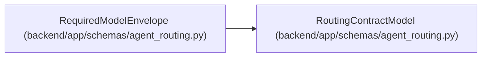

# RequiredModelEnvelope

**Location:** `backend/app/schemas/agent_routing.py:522`
**Kind:** Pydantic model
**Bases:** `RoutingContractModel`
**Module:** [agent_routing](../modules/agent_routing.md)

## Description

Minimum provider-neutral runtime capabilities required by a task.

## Validators

| Method | Scope | Fields | Mode | Options |
|--------|-------|--------|------|---------|
| `require_integer_reasoning_tier` | field | minimum_reasoning_tier | before | — |
| `validate_tags` | field | modality_tags, tool_tags, data_policy_tags | after | — |

## Attributes

| Name | Type | Wire name | Required | Nullable | Default | Constraints | Examples | Description |
|------|------|-----------|----------|----------|---------|-------------|-------------|----------|
| `minimum_reasoning_tier` | `ReasoningTier` | `minimum_reasoning_tier` | Yes | No | — | — | — | — |
| `minimum_context_tier` | `ModelContextTier` | `minimum_context_tier` | Yes | No | — | — | — | — |
| `modality_tags` | `list[str]` | `modality_tags` | No | No | factory: `lambda: ['text']` | — | — | — |
| `tool_tags` | `list[str]` | `tool_tags` | No | No | factory: `list` | — | — | — |
| `data_policy_tags` | `list[str]` | `data_policy_tags` | No | No | factory: `list` | — | — | — |

## Methods

| Method | Signature | Decorators | Description |
|--------|-----------|------------|-------------|
| `require_integer_reasoning_tier` | `(value: Any) -> Any` | `@field_validator('minimum_reasoning_tier', mode='before')`, `@classmethod` | — |
| `validate_tags` | `(value: list[str], info: Any) -> list[str]` | `@field_validator('modality_tags', 'tool_tags', 'data_policy_tags')`, `@classmethod` | — |

## Relationships

<!-- Auto-generated relationship summary. Do not edit by hand. -->

### Summary

| Module | Methods | Attributes |
|---|---:|---|
| [agent_routing](../modules/agent_routing.md) | 2 | `data_policy_tags`, `minimum_context_tier`, `minimum_reasoning_tier`, `modality_tags`, `tool_tags` |

### Structure

| Kind | Entity | Module |
|---|---|---|
| Base | `RoutingContractModel` | [agent_routing](../modules/agent_routing.md) |
