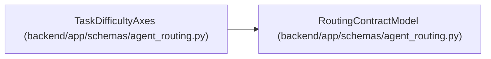

# TaskDifficultyAxes

**Location:** `backend/app/schemas/agent_routing.py:503`
**Kind:** Pydantic model
**Bases:** `RoutingContractModel`
**Module:** [agent_routing](../modules/agent_routing.md)

## Description

Five governed task-difficulty axes on a closed 1..3 scale.

## Attributes

| Name | Type | Wire name | Required | Nullable | Default | Constraints | Examples | Description |
|------|------|-----------|----------|----------|---------|-------------|-------------|----------|
| `reasoning` | `DifficultyScore` | `reasoning` | Yes | No | — | — | — | — |
| `ambiguity` | `DifficultyScore` | `ambiguity` | Yes | No | — | — | — | — |
| `context_breadth` | `DifficultyScore` | `context_breadth` | Yes | No | — | — | — | — |
| `risk` | `DifficultyScore` | `risk` | Yes | No | — | — | — | — |
| `verification_burden` | `DifficultyScore` | `verification_burden` | Yes | No | — | — | — | — |

## Methods

| Method | Signature | Decorators | Description |
|--------|-----------|------------|-------------|
| `values` | `() -> tuple[int, ...]` | — | — |

## Relationships

<!-- Auto-generated relationship summary. Do not edit by hand. -->

### Summary

| Module | Methods | Attributes |
|---|---:|---|
| [agent_routing](../modules/agent_routing.md) | 1 | `ambiguity`, `context_breadth`, `reasoning`, `risk`, `verification_burden` |

### Structure

| Kind | Entity | Module |
|---|---|---|
| Base | `RoutingContractModel` | [agent_routing](../modules/agent_routing.md) |
