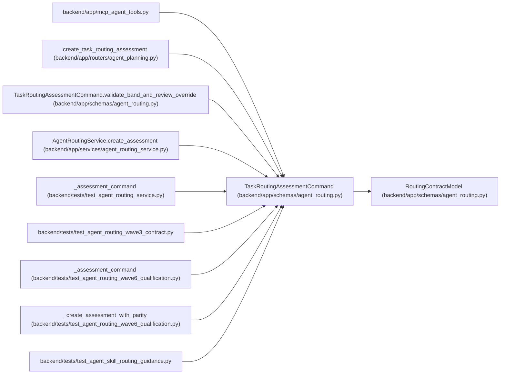

# TaskRoutingAssessmentCommand

**Location:** `backend/app/schemas/agent_routing.py:610`
**Kind:** Pydantic model
**Bases:** `RoutingContractModel`
**Module:** [agent_routing](../modules/agent_routing.md)

## Description

Authorized client input; identity and policy fields are server-owned.

## Validators

| Method | Scope | Fields | Mode | Options |
|--------|-------|--------|------|---------|
| `validate_required_skills` | field | required_skill_levels | before | — |
| `validate_reason_codes` | field | reason_codes | before | — |
| `strip_rationale` | field | rationale | after | — |
| `require_authoritative_confidence` | field | confidence | after | — |
| `validate_band_and_review_override` | model | — | after | — |

## Attributes

| Name | Type | Wire name | Required | Nullable | Default | Constraints | Examples | Description |
|------|------|-----------|----------|----------|---------|-------------|-------------|----------|
| `expected_task_version` | `int` | `expected_task_version` | Yes | No | — | ge=1; strict=True | — | — |
| `band` | `TaskDifficultyBand` | `band` | Yes | No | — | — | — | — |
| `axes` | `TaskDifficultyAxes` | `axes` | Yes | No | — | — | — | — |
| `required_skill_levels` | `dict[str, SkillLevel]` | `required_skill_levels` | No | No | factory: `dict` | — | — | — |
| `required_model` | `RequiredModelEnvelope` | `required_model` | Yes | No | — | — | — | — |
| `review_mode` | `TaskReviewMode` | `review_mode` | Yes | No | — | — | — | — |
| `confidence` | `float` | `confidence` | Yes | No | — | le=1.0; ge=unknown (MIN_ROUTING_ASSESSMENT_CONFIDENCE) | — | — |
| `reason_codes` | `list[AssessmentReasonCode]` | `reason_codes` | No | No | factory: `list` | — | — | — |
| `rationale` | `str` | `rationale` | Yes | No | — | min_length=1; max_length=unknown (MAX_ROUTING_TEXT_LENGTH) | — | — |

## Methods

| Method | Signature | Decorators | Description |
|--------|-----------|------------|-------------|
| `validate_required_skills` | `(value: Any) -> Any` | `@field_validator('required_skill_levels', mode='before')`, `@classmethod` | — |
| `validate_reason_codes` | `(value: Any) -> Any` | `@field_validator('reason_codes', mode='before')`, `@classmethod` | — |
| `strip_rationale` | `(value: str) -> str` | `@field_validator('rationale')`, `@classmethod` | — |
| `require_authoritative_confidence` | `(value: float) -> float` | `@field_validator('confidence')`, `@classmethod` | — |
| `validate_band_and_review_override` | `() -> 'TaskRoutingAssessmentCommand'` | `@model_validator(mode='after')` | — |

## Relationships

<!-- Auto-generated relationship summary. Do not edit by hand. -->

### Summary

| Module | Methods | Attributes |
|---|---:|---|
| [agent_routing](../modules/agent_routing.md) | 5 | `axes`, `band`, `confidence`, `expected_task_version`, `rationale`, `reason_codes`, `required_model`, `required_skill_levels`, `review_mode` |

### Structure

| Kind | Entity | Module |
|---|---|---|
| Base | `RoutingContractModel` | [agent_routing](../modules/agent_routing.md) |

### References

| Reference | Kind | Source | Call sites |
|---|---|---|---:|
| `mcp_agent_tools` | import | [mcp_agent_tools](../modules/mcp_agent_tools.md) | — |
| `create_task_routing_assessment` | type_reference | [routers_agent_planning](../modules/routers_agent_planning.md) | — |
| `TaskRoutingAssessmentCommand.validate_band_and_review_override` | type_reference | [agent_routing](../modules/agent_routing.md) | — |
| `AgentRoutingService.create_assessment` | type_reference | [agent_routing_service](../modules/agent_routing_service.md) | — |
| `_assessment_command` | call | [test_agent_routing_service](../modules/test_agent_routing_service.md) | 1 |
| `_assessment_command` | type_reference | [test_agent_routing_service](../modules/test_agent_routing_service.md) | — |
| `test_agent_routing_wave3_contract` | import | [test_agent_routing_wave3_contract](../modules/test_agent_routing_wave3_contract.md) | — |
| `_assessment_command` | call | [test_agent_routing_wave6_qualification](../modules/test_agent_routing_wave6_qualification.md) | 1 |
| `_assessment_command` | type_reference | [test_agent_routing_wave6_qualification](../modules/test_agent_routing_wave6_qualification.md) | — |
| `_create_assessment_with_parity` | type_reference | [test_agent_routing_wave6_qualification](../modules/test_agent_routing_wave6_qualification.md) | — |
| `test_agent_skill_routing_guidance` | import | [test_agent_skill_routing_guidance](../modules/test_agent_skill_routing_guidance.md) | — |
