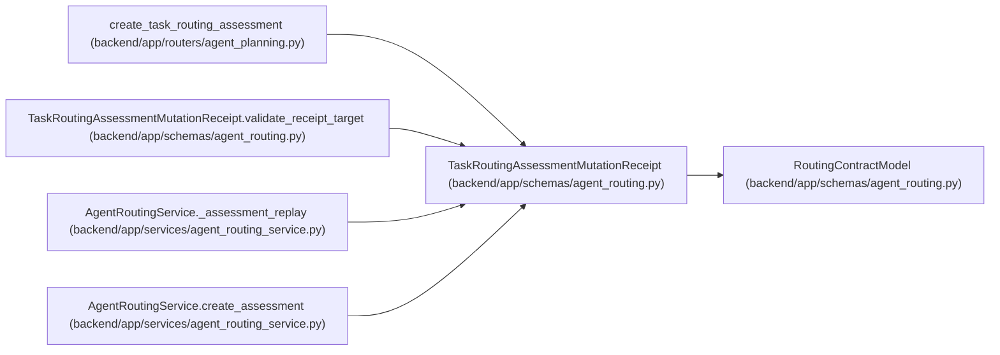

# TaskRoutingAssessmentMutationReceipt

**Location:** `backend/app/schemas/agent_routing.py:869`
**Kind:** Pydantic model
**Bases:** `RoutingContractModel`
**Module:** [agent_routing](../modules/agent_routing.md)

## Description

Durable replay-safe receipt for an authoritative assessment write.

## Validators

| Method | Scope | Fields | Mode | Options |
|--------|-------|--------|------|---------|
| `validate_receipt_text` | field | idempotency_key, rationale, correlation_id | after | — |
| `validate_audit_event_ids` | field | audit_event_ids | after | — |
| `validate_receipt_target` | model | — | after | — |

## Attributes

| Name | Type | Wire name | Required | Nullable | Default | Constraints | Examples | Description |
|------|------|-----------|----------|----------|---------|-------------|-------------|----------|
| `operation` | `Literal['routing.assessment.create']` | `operation` | No | No | `'routing.assessment.create'` | — | — | — |
| `actor_id` | `int` | `actor_id` | Yes | No | — | strict=True; ge=1 | — | — |
| `target_type` | `Literal['task_routing_assessment']` | `target_type` | No | No | `'task_routing_assessment'` | — | — | — |
| `target_id` | `int` | `target_id` | Yes | No | — | strict=True; ge=1 | — | — |
| `task_id` | `int` | `task_id` | Yes | No | — | strict=True; ge=1 | — | — |
| `idempotency_key` | `str` | `idempotency_key` | Yes | No | — | min_length=1; max_length=255 | — | — |
| `rationale` | `str` | `rationale` | Yes | No | — | min_length=1; max_length=2000 | — | — |
| `correlation_id` | `str` | `correlation_id` | Yes | No | — | min_length=1; max_length=255 | — | — |
| `authoritative_task_version` | `int` | `authoritative_task_version` | Yes | No | — | strict=True; ge=1 | — | — |
| `assessment` | `TaskRoutingAssessmentResponse` | `assessment` | Yes | No | — | — | — | — |
| `audit_event_ids` | `list[int]` | `audit_event_ids` | No | No | factory: `list` | max_length=16 | — | — |

## Methods

| Method | Signature | Decorators | Description |
|--------|-----------|------------|-------------|
| `validate_receipt_text` | `(value: str) -> str` | `@field_validator('idempotency_key', 'rationale', 'correlation_id')`, `@classmethod` | — |
| `validate_audit_event_ids` | `(value: list[int]) -> list[int]` | `@field_validator('audit_event_ids')`, `@classmethod` | — |
| `validate_receipt_target` | `() -> 'TaskRoutingAssessmentMutationReceipt'` | `@model_validator(mode='after')` | — |

## Relationships

<!-- Auto-generated relationship summary. Do not edit by hand. -->

### Summary

| Module | Methods | Attributes |
|---|---:|---|
| [agent_routing](../modules/agent_routing.md) | 3 | `actor_id`, `assessment`, `audit_event_ids`, `authoritative_task_version`, `correlation_id`, `idempotency_key`, `operation`, `rationale`, `target_id`, `target_type`, `task_id` |

### Structure

| Kind | Entity | Module |
|---|---|---|
| Base | `RoutingContractModel` | [agent_routing](../modules/agent_routing.md) |

### References

| Reference | Kind | Source | Call sites |
|---|---|---|---:|
| `create_task_routing_assessment` | type_reference | [routers_agent_planning](../modules/routers_agent_planning.md) | — |
| `TaskRoutingAssessmentMutationReceipt.validate_receipt_target` | type_reference | [agent_routing](../modules/agent_routing.md) | — |
| `AgentRoutingService._assessment_replay` | type_reference | [agent_routing_service](../modules/agent_routing_service.md) | — |
| `AgentRoutingService.create_assessment` | call | [agent_routing_service](../modules/agent_routing_service.md) | 1 |
| `AgentRoutingService.create_assessment` | type_reference | [agent_routing_service](../modules/agent_routing_service.md) | — |
