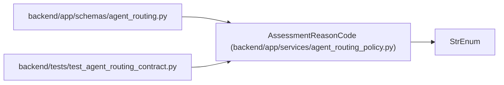

# AssessmentReasonCode

**Location:** `backend/app/services/agent_routing_policy.py:160`
**Kind:** Enum
**Bases:** `StrEnum`
**Module:** [agent_routing_policy](../modules/agent_routing_policy.md)

## Description

Governed reasons that may raise the derived band or review floor.

## Attributes

| Name | Declared value | Description |
|------|-------|-------------|
| `NOVEL_ARCHITECTURE` | `'novel-architecture'` | — |
| `MATERIAL_AMBIGUITY` | `'material-ambiguity'` | — |
| `BROAD_CONTEXT` | `'broad-context'` | — |
| `SECURITY` | `'security'` | — |
| `AUTHORIZATION` | `'authorization'` | — |
| `MIGRATION` | `'migration'` | — |
| `DATA_INTEGRITY` | `'data-integrity'` | — |
| `CONCURRENCY` | `'concurrency'` | — |
| `PRODUCTION` | `'production'` | — |
| `IRREVERSIBLE_CHANGE` | `'irreversible-change'` | — |
| `INDEPENDENT_VERIFICATION` | `'independent-verification'` | — |
| `SPECIALIST_VERIFICATION` | `'specialist-verification'` | — |

## Methods

*No public methods. Inherits from base classes.*

## Relationships

<!-- Auto-generated relationship summary. Do not edit by hand. -->

### Summary

| Module | Methods | Attributes |
|---|---:|---|
| [agent_routing_policy](../modules/agent_routing_policy.md) | 0 | `AUTHORIZATION`, `BROAD_CONTEXT`, `CONCURRENCY`, `DATA_INTEGRITY`, `INDEPENDENT_VERIFICATION`, `IRREVERSIBLE_CHANGE`, `MATERIAL_AMBIGUITY`, `MIGRATION`, `NOVEL_ARCHITECTURE`, `PRODUCTION`, `SECURITY`, `SPECIALIST_VERIFICATION` |

### Structure

| Kind | Entity | Module |
|---|---|---|
| Base | `StrEnum` | — |

### References

| Reference | Kind | Source | Call sites |
|---|---|---|---:|
| `agent_routing` | import | [agent_routing](../modules/agent_routing.md) | — |
| `test_agent_routing_contract` | import | [test_agent_routing_contract](../modules/test_agent_routing_contract.md) | — |
