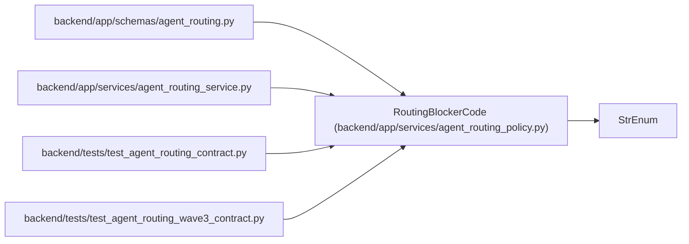

# RoutingBlockerCode

**Location:** `backend/app/services/agent_routing_policy.py:186`
**Kind:** Enum
**Bases:** `StrEnum`
**Module:** [agent_routing_policy](../modules/agent_routing_policy.md)

## Description

Stable hard blockers shared by preview and assignment enforcement.

## Attributes

| Name | Declared value | Description |
|------|-------|-------------|
| `ASSIGNMENT_PURPOSE_QUEUE_CLASS_INCOMPATIBLE` | `'assignment_purpose_queue_class_incompatible'` | — |
| `ASSESSMENT_MISSING` | `'assessment_missing'` | — |
| `ASSESSMENT_STALE` | `'assessment_stale'` | — |
| `ASSESSMENT_POLICY_MISMATCH` | `'assessment_policy_mismatch'` | — |
| `ASSESSMENT_LOW_CONFIDENCE` | `'assessment_low_confidence'` | — |
| `TASK_DEFINITION_NOT_READY` | `'task_definition_not_ready'` | — |
| `TASK_STATUS_INCOMPATIBLE` | `'task_status_incompatible'` | — |
| `TASK_DEFERRED` | `'task_deferred'` | — |
| `TASK_COMPOSITE` | `'task_composite'` | — |
| `TASK_DEPENDENCY_UNRESOLVED` | `'task_dependency_unresolved'` | — |
| `ACTOR_DISABLED` | `'actor_disabled'` | — |
| `ACTOR_ROLE_INCOMPATIBLE` | `'actor_role_incompatible'` | — |
| `ACTOR_SCOPE_MISSING` | `'actor_scope_missing'` | — |
| `ACTOR_POLICY_INCOMPATIBLE` | `'actor_policy_incompatible'` | — |
| `ACTOR_TOPOLOGY_INCOMPATIBLE` | `'actor_topology_incompatible'` | — |
| `ACTOR_PROFILE_MISSING` | `'actor_profile_missing'` | — |
| `CAPACITY_OWNER_MISSING` | `'capacity_owner_missing'` | — |
| `CAPACITY_OWNER_PROFILE_MISSING` | `'capacity_owner_profile_missing'` | — |
| `ACTOR_CAPACITY_PROFILE_MISMATCH` | `'actor_capacity_profile_mismatch'` | — |
| `PROFILE_KIND_HUMAN` | `'profile_kind_human'` | — |
| `PROFILE_KIND_UNSUPPORTED` | `'profile_kind_unsupported'` | — |
| `PROFILE_AUTOMATION_DISABLED` | `'profile_automation_disabled'` | — |
| `PROFILE_ASSIGNMENT_MODE_MISSING` | `'profile_assignment_mode_missing'` | — |
| `REQUIRED_SKILL_MISSING` | `'required_skill_missing'` | — |
| `REQUIRED_SKILL_LEVEL_INSUFFICIENT` | `'required_skill_level_insufficient'` | — |
| `REQUIRED_SKILL_BLOCKING_WEAKNESS` | `'required_skill_blocking_weakness'` | — |
| `MODEL_BINDING_MISSING` | `'model_binding_missing'` | — |
| `MODEL_BINDING_DISABLED` | `'model_binding_disabled'` | — |
| `MODEL_BINDING_STALE` | `'model_binding_stale'` | — |
| `MODEL_CATALOG_MISSING` | `'model_catalog_missing'` | — |
| `MODEL_CATALOG_DISABLED` | `'model_catalog_disabled'` | — |
| `MODEL_REASONING_TIER_INSUFFICIENT` | `'model_reasoning_tier_insufficient'` | — |
| `MODEL_CONTEXT_TIER_INSUFFICIENT` | `'model_context_tier_insufficient'` | — |
| `MODEL_MODALITY_MISSING` | `'model_modality_missing'` | — |
| `MODEL_TOOL_MISSING` | `'model_tool_missing'` | — |
| `MODEL_DATA_POLICY_MISSING` | `'model_data_policy_missing'` | — |
| `CAPACITY_UNAVAILABLE` | `'capacity_unavailable'` | — |
| `WORKLOAD_LIMIT_EXCEEDED` | `'workload_limit_exceeded'` | — |
| `VACATION_CONFLICT` | `'vacation_conflict'` | — |
| `SCHEDULE_MISSING` | `'schedule_missing'` | — |
| `SCHEDULE_CONFLICT` | `'schedule_conflict'` | — |
| `QUEUE_LIMIT_EXCEEDED` | `'queue_limit_exceeded'` | — |
| `CURRENT_WORK_CONFLICT` | `'current_work_conflict'` | — |
| `REVIEWER_PROFILE_MISSING` | `'reviewer_profile_missing'` | — |
| `REVIEWER_PROFILE_MISMATCH` | `'reviewer_profile_mismatch'` | — |
| `VERIFICATION_ACTOR_NOT_INDEPENDENT` | `'verification_actor_not_independent'` | — |
| `VERIFICATION_PROFILE_NOT_INDEPENDENT` | `'verification_profile_not_independent'` | — |
| `VERIFICATION_INDEPENDENCE_UNVERIFIABLE` | `'verification_independence_unverifiable'` | — |
| `VERIFICATION_SPECIALIST_SKILL_MISSING` | `'verification_specialist_skill_missing'` | — |
| `PREVIEW_NOT_FOUND` | `'preview_not_found'` | — |
| `PREVIEW_STALE` | `'preview_stale'` | — |
| `PREVIEW_EXPIRED` | `'preview_expired'` | — |
| `PREVIEW_DIGEST_MISMATCH` | `'preview_digest_mismatch'` | — |
| `NO_ELIGIBLE_CANDIDATE` | `'no_eligible_candidate'` | — |

## Methods

*No public methods. Inherits from base classes.*

## Relationships

<!-- Auto-generated relationship summary. Do not edit by hand. -->

### Summary

| Module | Methods | Attributes |
|---|---:|---|
| [agent_routing_policy](../modules/agent_routing_policy.md) | 0 | `ACTOR_CAPACITY_PROFILE_MISMATCH`, `ACTOR_DISABLED`, `ACTOR_POLICY_INCOMPATIBLE`, `ACTOR_PROFILE_MISSING`, `ACTOR_ROLE_INCOMPATIBLE`, `ACTOR_SCOPE_MISSING`, `ACTOR_TOPOLOGY_INCOMPATIBLE`, `ASSESSMENT_LOW_CONFIDENCE`, `ASSESSMENT_MISSING`, `ASSESSMENT_POLICY_MISMATCH`, `ASSESSMENT_STALE`, `ASSIGNMENT_PURPOSE_QUEUE_CLASS_INCOMPATIBLE` |

### Structure

| Kind | Entity | Module |
|---|---|---|
| Base | `StrEnum` | — |

### References

| Reference | Kind | Source | Call sites |
|---|---|---|---:|
| `agent_routing` | import | [agent_routing](../modules/agent_routing.md) | — |
| `agent_routing_service` | import | [agent_routing_service](../modules/agent_routing_service.md) | — |
| `test_agent_routing_contract` | import | [test_agent_routing_contract](../modules/test_agent_routing_contract.md) | — |
| `test_agent_routing_wave3_contract` | import | [test_agent_routing_wave3_contract](../modules/test_agent_routing_wave3_contract.md) | — |
