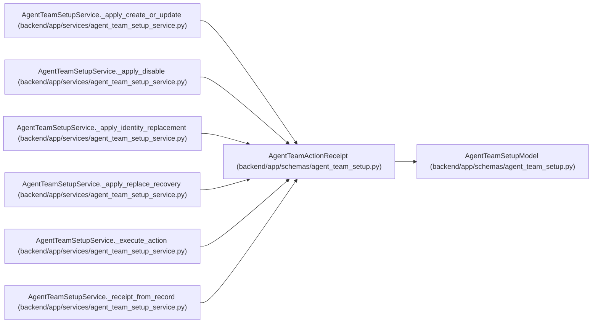

# AgentTeamActionReceipt

**Location:** `backend/app/schemas/agent_team_setup.py:762`
**Kind:** Pydantic model
**Bases:** `AgentTeamSetupModel`
**Module:** [agent_team_setup](../modules/agent_team_setup.md)

## Description

_Auto-generated from `AgentTeamActionReceipt` in `backend/app/schemas/agent_team_setup.py`._

## Attributes

| Name | Type | Wire name | Required | Nullable | Default | Constraints | Examples | Description |
|------|------|-----------|----------|----------|---------|-------------|-------------|----------|
| `action_id` | `str` | `action_id` | Yes | No | — | pattern=unknown (ACTION_ID_PATTERN) | — | — |
| `action_digest` | `str` | `action_digest` | Yes | No | — | pattern=unknown (SHA256_PATTERN) | — | — |
| `reconciliation_class` | `AgentTeamReconciliationClass` | `reconciliation_class` | Yes | No | — | — | — | — |
| `operation` | `str` | `operation` | Yes | No | — | pattern=unknown (FEATURE_PATTERN) | — | — |
| `actor_key` | `str` | `actor_key` | Yes | No | — | pattern=unknown (STABLE_KEY_PATTERN) | — | — |
| `status` | `AgentTeamActionStatus` | `status` | Yes | No | — | — | — | — |
| `target_actor_id` | `int \| None` | `target_actor_id` | No | Yes | `None` | ge=1 | — | — |
| `before_revision` | `int \| None` | `before_revision` | No | Yes | `None` | ge=1 | — | — |
| `after_revision` | `int \| None` | `after_revision` | No | Yes | `None` | ge=1 | — | — |
| `blocker_code` | `str \| None` | `blocker_code` | No | Yes | `None` | pattern=unknown (FEATURE_PATTERN) | — | — |
| `next_action` | `str \| None` | `next_action` | No | Yes | `None` | max_length=255 | — | — |

## Methods

*No public methods. Inherits from base classes.*

## Relationships

<!-- Auto-generated relationship summary. Do not edit by hand. -->

### Summary

| Module | Methods | Attributes |
|---|---:|---|
| [agent_team_setup](../modules/agent_team_setup.md) | 0 | `action_digest`, `action_id`, `actor_key`, `after_revision`, `before_revision`, `blocker_code`, `next_action`, `operation`, `reconciliation_class`, `status`, `target_actor_id` |

### Structure

| Kind | Entity | Module |
|---|---|---|
| Base | `AgentTeamSetupModel` | [agent_team_setup](../modules/agent_team_setup.md) |

### References

| Reference | Kind | Source | Call sites |
|---|---|---|---:|
| `AgentTeamSetupService._apply_create_or_update` | call | [agent_team_setup_service](../modules/agent_team_setup_service.md) | 2 |
| `AgentTeamSetupService._apply_create_or_update` | type_reference | [agent_team_setup_service](../modules/agent_team_setup_service.md) | — |
| `AgentTeamSetupService._apply_disable` | call | [agent_team_setup_service](../modules/agent_team_setup_service.md) | 1 |
| `AgentTeamSetupService._apply_disable` | type_reference | [agent_team_setup_service](../modules/agent_team_setup_service.md) | — |
| `AgentTeamSetupService._apply_identity_replacement` | call | [agent_team_setup_service](../modules/agent_team_setup_service.md) | 4 |
| `AgentTeamSetupService._apply_identity_replacement` | type_reference | [agent_team_setup_service](../modules/agent_team_setup_service.md) | — |
| `AgentTeamSetupService._apply_replace_recovery` | call | [agent_team_setup_service](../modules/agent_team_setup_service.md) | 4 |
| `AgentTeamSetupService._apply_replace_recovery` | type_reference | [agent_team_setup_service](../modules/agent_team_setup_service.md) | — |
| `AgentTeamSetupService._execute_action` | call | [agent_team_setup_service](../modules/agent_team_setup_service.md) | 3 |
| `AgentTeamSetupService._execute_action` | type_reference | [agent_team_setup_service](../modules/agent_team_setup_service.md) | — |
| `AgentTeamSetupService._receipt_from_record` | call | [agent_team_setup_service](../modules/agent_team_setup_service.md) | 1 |
| `AgentTeamSetupService._receipt_from_record` | type_reference | [agent_team_setup_service](../modules/agent_team_setup_service.md) | — |

> References: showing 12 of 14 logical references; 2 omitted by the 12-row generated summary limit.
