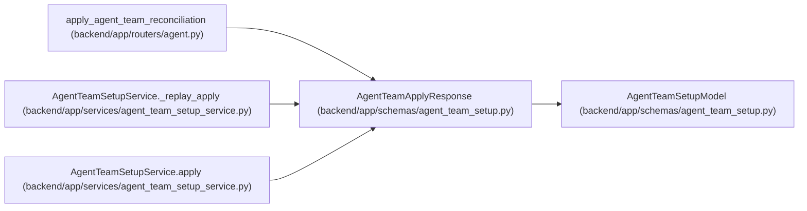

# AgentTeamApplyResponse

**Location:** `backend/app/schemas/agent_team_setup.py:776`
**Kind:** Pydantic model
**Bases:** `AgentTeamSetupModel`
**Module:** [agent_team_setup](../modules/agent_team_setup.md)

## Description

_Auto-generated from `AgentTeamApplyResponse` in `backend/app/schemas/agent_team_setup.py`._

## Attributes

| Name | Type | Wire name | Required | Nullable | Default | Constraints | Examples | Description |
|------|------|-----------|----------|----------|---------|-------------|-------------|----------|
| `schema_version` | `Literal['agent-team-apply-receipt-v1']` | `schema_version` | No | No | `'agent-team-apply-receipt-v1'` | — | — | — |
| `apply_id` | `str` | `apply_id` | Yes | No | — | pattern='^[0-9a-f]{32}$' | — | — |
| `topology_key` | `str` | `topology_key` | Yes | No | — | pattern=unknown (STABLE_KEY_PATTERN) | — | — |
| `manifest_digest` | `str` | `manifest_digest` | Yes | No | — | pattern=unknown (SHA256_PATTERN) | — | — |
| `plan_digest` | `str` | `plan_digest` | Yes | No | — | pattern=unknown (SHA256_PATTERN) | — | — |
| `expected_topology_revision` | `int` | `expected_topology_revision` | Yes | No | — | ge=0 | — | — |
| `resulting_topology_revision` | `int` | `resulting_topology_revision` | Yes | No | — | ge=0 | — | — |
| `status` | `Literal['completed', 'partial', 'blocked']` | `status` | Yes | No | — | — | — | — |
| `replayed` | `bool` | `replayed` | No | No | `False` | — | — | — |
| `receipts` | `tuple[AgentTeamActionReceipt, ...]` | `receipts` | Yes | No | — | max_length=unknown (MAX_AGENT_TEAM_ACTIONS) | — | — |
| `pending_action_ids` | `tuple[str, ...]` | `pending_action_ids` | No | No | `()` | max_length=unknown (MAX_AGENT_TEAM_ACTIONS) | — | — |
| `blocker_codes` | `tuple[str, ...]` | `blocker_codes` | No | No | `()` | max_length=unknown (MAX_AGENT_TEAM_BLOCKERS) | — | — |

## Methods

*No public methods. Inherits from base classes.*

## Relationships

<!-- Auto-generated relationship summary. Do not edit by hand. -->

### Summary

| Module | Methods | Attributes |
|---|---:|---|
| [agent_team_setup](../modules/agent_team_setup.md) | 0 | `apply_id`, `blocker_codes`, `expected_topology_revision`, `manifest_digest`, `pending_action_ids`, `plan_digest`, `receipts`, `replayed`, `resulting_topology_revision`, `schema_version`, `status`, `topology_key` |

### Structure

| Kind | Entity | Module |
|---|---|---|
| Base | `AgentTeamSetupModel` | [agent_team_setup](../modules/agent_team_setup.md) |

### References

| Reference | Kind | Source | Call sites |
|---|---|---|---:|
| `apply_agent_team_reconciliation` | type_reference | [routers_agent](../modules/routers_agent.md) | — |
| `AgentTeamSetupService._replay_apply` | type_reference | [agent_team_setup_service](../modules/agent_team_setup_service.md) | — |
| `AgentTeamSetupService.apply` | call | [agent_team_setup_service](../modules/agent_team_setup_service.md) | 1 |
| `AgentTeamSetupService.apply` | type_reference | [agent_team_setup_service](../modules/agent_team_setup_service.md) | — |
