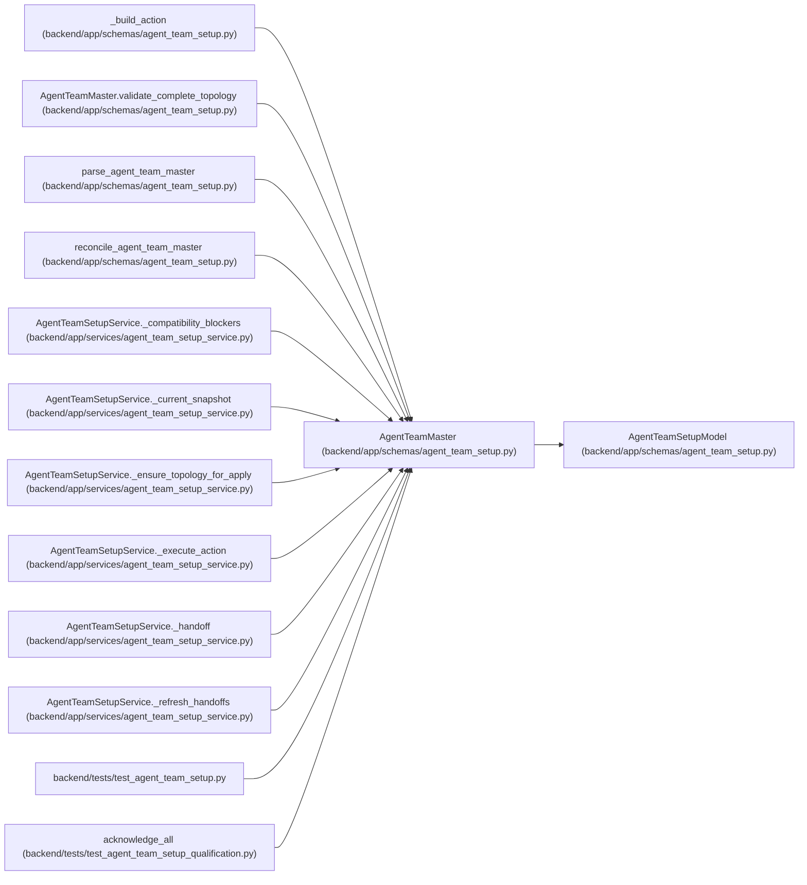

# AgentTeamMaster

**Location:** `backend/app/schemas/agent_team_setup.py:264`
**Kind:** Pydantic model
**Bases:** `AgentTeamSetupModel`
**Module:** [agent_team_setup](../modules/agent_team_setup.md)

## Description

Canonical portable desired-state document for one agent team.

## Validators

| Method | Scope | Fields | Mode | Options |
|--------|-------|--------|------|---------|
| `validate_server_url` | field | server_url | after | — |
| `validate_credential_sink_ref` | field | credential_sink_ref | after | — |
| `normalize_required_features` | field | required_server_features | after | — |
| `validate_complete_topology` | model | — | after | — |

## Attributes

| Name | Type | Wire name | Required | Nullable | Default | Constraints | Examples | Description |
|------|------|-----------|----------|----------|---------|-------------|-------------|----------|
| `schema_version` | `Literal['agent-team-master-v1']` | `schema_version` | No | No | `AGENT_TEAM_MASTER_SCHEMA_VERSION` | — | — | — |
| `topology_key` | `str` | `topology_key` | Yes | No | — | max_length=100; pattern=unknown (STABLE_KEY_PATTERN) | — | — |
| `server_url` | `str` | `server_url` | Yes | No | — | max_length=2000; min_length=1 | — | — |
| `credential_sink_ref` | `str` | `credential_sink_ref` | Yes | No | — | max_length=1024; min_length=1 | — | — |
| `required_server_features` | `tuple[str, ...]` | `required_server_features` | Yes | No | — | max_length=64; min_length=1 | — | — |
| `controller` | `AgentTeamMemberSpec` | `controller` | Yes | No | — | — | — | — |
| `workers` | `tuple[AgentTeamMemberSpec, ...]` | `workers` | Yes | No | — | min_length=1; max_length=unknown (MAX_AGENT_TEAM_MEMBERS - 1) | — | — |
| `verifiers` | `tuple[AgentTeamMemberSpec, ...]` | `verifiers` | No | No | `()` | max_length=unknown (MAX_AGENT_TEAM_MEMBERS - 2) | — | — |
| `readiness_policy` | `AgentTeamReadinessPolicy` | `readiness_policy` | No | No | factory: `AgentTeamReadinessPolicy` | — | — | — |

## Methods

| Method | Signature | Decorators | Description |
|--------|-----------|------------|-------------|
| `validate_server_url` | `(value: str) -> str` | `@field_validator('server_url')`, `@classmethod` | — |
| `validate_credential_sink_ref` | `(value: str) -> str` | `@field_validator('credential_sink_ref')`, `@classmethod` | — |
| `normalize_required_features` | `(value: tuple[str, ...]) -> tuple[str, ...]` | `@field_validator('required_server_features')`, `@classmethod` | — |
| `validate_complete_topology` | `() -> 'AgentTeamMaster'` | `@model_validator(mode='after')` | — |
| `all_members` | `() -> tuple[AgentTeamMemberSpec, ...]` | `@property` | — |
| `canonical_bytes` | `() -> bytes` | — | — |
| `digest` | `() -> str` | — | — |

## Relationships

<!-- Auto-generated relationship summary. Do not edit by hand. -->

### Summary

| Module | Methods | Attributes |
|---|---:|---|
| [agent_team_setup](../modules/agent_team_setup.md) | 7 | `controller`, `credential_sink_ref`, `readiness_policy`, `required_server_features`, `schema_version`, `server_url`, `topology_key`, `verifiers`, `workers` |

### Structure

| Kind | Entity | Module |
|---|---|---|
| Base | `AgentTeamSetupModel` | [agent_team_setup](../modules/agent_team_setup.md) |

### References

| Reference | Kind | Source | Call sites |
|---|---|---|---:|
| `_build_action` | type_reference | [agent_team_setup](../modules/agent_team_setup.md) | — |
| `AgentTeamMaster.validate_complete_topology` | type_reference | [agent_team_setup](../modules/agent_team_setup.md) | — |
| `parse_agent_team_master` | type_reference | [agent_team_setup](../modules/agent_team_setup.md) | — |
| `reconcile_agent_team_master` | type_reference | [agent_team_setup](../modules/agent_team_setup.md) | — |
| `AgentTeamSetupService._compatibility_blockers` | type_reference | [agent_team_setup_service](../modules/agent_team_setup_service.md) | — |
| `AgentTeamSetupService._current_snapshot` | type_reference | [agent_team_setup_service](../modules/agent_team_setup_service.md) | — |
| `AgentTeamSetupService._ensure_topology_for_apply` | type_reference | [agent_team_setup_service](../modules/agent_team_setup_service.md) | — |
| `AgentTeamSetupService._execute_action` | type_reference | [agent_team_setup_service](../modules/agent_team_setup_service.md) | — |
| `AgentTeamSetupService._handoff` | type_reference | [agent_team_setup_service](../modules/agent_team_setup_service.md) | — |
| `AgentTeamSetupService._refresh_handoffs` | type_reference | [agent_team_setup_service](../modules/agent_team_setup_service.md) | — |
| `test_agent_team_setup` | import | [test_agent_team_setup](../modules/test_agent_team_setup.md) | — |
| `acknowledge_all` | type_reference | [test_agent_team_setup_qualification](../modules/test_agent_team_setup_qualification.md) | — |

> References: showing 12 of 18 logical references; 6 omitted by the 12-row generated summary limit.
