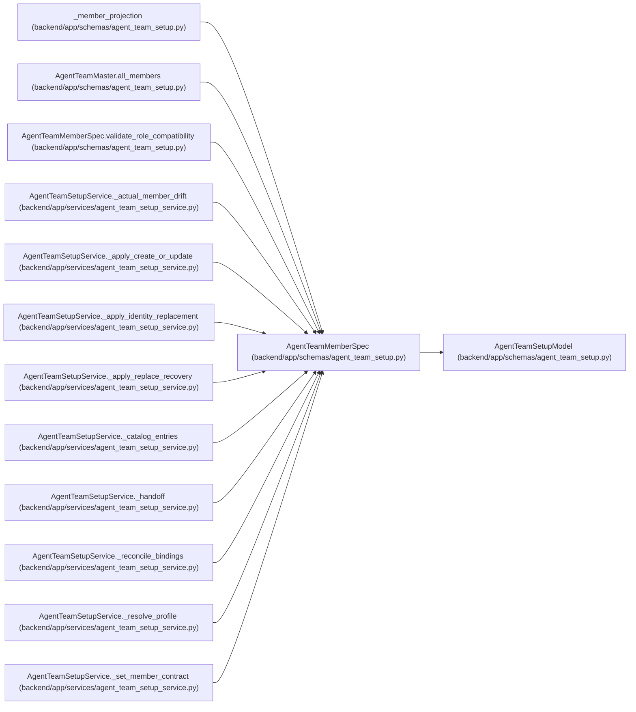

# AgentTeamMemberSpec

**Location:** `backend/app/schemas/agent_team_setup.py:176`
**Kind:** Pydantic model
**Bases:** `AgentTeamSetupModel`
**Module:** [agent_team_setup](../modules/agent_team_setup.md)

## Description

Portable desired state for one logical actor/runtime membership.

## Validators

| Method | Scope | Fields | Mode | Options |
|--------|-------|--------|------|---------|
| `normalize_assignment_modes` | field | assignment_modes | after | — |
| `normalize_model_binding_keys` | field | model_binding_keys | after | — |
| `validate_external_references` | field | runtime_ref, credential_ref | after | — |
| `validate_role_compatibility` | model | — | after | — |

## Attributes

| Name | Type | Wire name | Required | Nullable | Default | Constraints | Examples | Description |
|------|------|-----------|----------|----------|---------|-------------|-------------|----------|
| `actor_key` | `str` | `actor_key` | Yes | No | — | max_length=100; pattern=unknown (STABLE_KEY_PATTERN) | — | — |
| `actor_name` | `str` | `actor_name` | Yes | No | — | max_length=100; pattern=unknown (STABLE_KEY_PATTERN) | — | — |
| `display_name` | `str` | `display_name` | Yes | No | — | min_length=1; max_length=255 | — | — |
| `role` | `Literal['pm', 'worker', 'verifier']` | `role` | Yes | No | — | — | — | — |
| `scope_preset` | `Literal['pm-v1', 'worker-v1', 'verifier-v1']` | `scope_preset` | Yes | No | — | — | — | — |
| `profile_key` | `str` | `profile_key` | Yes | No | — | max_length=120; pattern=unknown (STABLE_KEY_PATTERN) | — | — |
| `skill_package` | `AgentTeamSkillPackage` | `skill_package` | Yes | No | — | — | — | — |
| `assignment_modes` | `tuple[Literal['ownership', 'execution', 'verification', 'design_handoff'], ...]` | `assignment_modes` | Yes | No | — | min_length=1; max_length=4 | — | — |
| `model_binding_keys` | `tuple[str, ...]` | `model_binding_keys` | Yes | No | — | min_length=1; max_length=16 | — | — |
| `default_model_binding_key` | `str` | `default_model_binding_key` | Yes | No | — | max_length=120; pattern=unknown (STABLE_KEY_PATTERN) | — | — |
| `runtime_ref` | `str` | `runtime_ref` | Yes | No | — | min_length=1; max_length=1024 | — | — |
| `credential_ref` | `str` | `credential_ref` | Yes | No | — | min_length=1; max_length=1024 | — | — |

## Methods

| Method | Signature | Decorators | Description |
|--------|-----------|------------|-------------|
| `normalize_assignment_modes` | `(value: tuple[str, ...]) -> tuple[str, ...]` | `@field_validator('assignment_modes')`, `@classmethod` | — |
| `normalize_model_binding_keys` | `(value: tuple[str, ...]) -> tuple[str, ...]` | `@field_validator('model_binding_keys')`, `@classmethod` | — |
| `validate_external_references` | `(value: str, info: Any) -> str` | `@field_validator('runtime_ref', 'credential_ref')`, `@classmethod` | — |
| `validate_role_compatibility` | `() -> 'AgentTeamMemberSpec'` | `@model_validator(mode='after')` | — |
| `digest` | `() -> str` | — | — |

## Relationships

<!-- Auto-generated relationship summary. Do not edit by hand. -->

### Summary

| Module | Methods | Attributes |
|---|---:|---|
| [agent_team_setup](../modules/agent_team_setup.md) | 5 | `actor_key`, `actor_name`, `assignment_modes`, `credential_ref`, `default_model_binding_key`, `display_name`, `model_binding_keys`, `profile_key`, `role`, `runtime_ref`, `scope_preset`, `skill_package` |

### Structure

| Kind | Entity | Module |
|---|---|---|
| Base | `AgentTeamSetupModel` | [agent_team_setup](../modules/agent_team_setup.md) |

### References

| Reference | Kind | Source | Call sites |
|---|---|---|---:|
| `_member_projection` | type_reference | [agent_team_setup](../modules/agent_team_setup.md) | — |
| `AgentTeamMaster.all_members` | type_reference | [agent_team_setup](../modules/agent_team_setup.md) | — |
| `AgentTeamMemberSpec.validate_role_compatibility` | type_reference | [agent_team_setup](../modules/agent_team_setup.md) | — |
| `AgentTeamSetupService._actual_member_drift` | type_reference | [agent_team_setup_service](../modules/agent_team_setup_service.md) | — |
| `AgentTeamSetupService._apply_create_or_update` | type_reference | [agent_team_setup_service](../modules/agent_team_setup_service.md) | — |
| `AgentTeamSetupService._apply_identity_replacement` | type_reference | [agent_team_setup_service](../modules/agent_team_setup_service.md) | — |
| `AgentTeamSetupService._apply_replace_recovery` | type_reference | [agent_team_setup_service](../modules/agent_team_setup_service.md) | — |
| `AgentTeamSetupService._catalog_entries` | type_reference | [agent_team_setup_service](../modules/agent_team_setup_service.md) | — |
| `AgentTeamSetupService._handoff` | type_reference | [agent_team_setup_service](../modules/agent_team_setup_service.md) | — |
| `AgentTeamSetupService._reconcile_bindings` | type_reference | [agent_team_setup_service](../modules/agent_team_setup_service.md) | — |
| `AgentTeamSetupService._resolve_profile` | type_reference | [agent_team_setup_service](../modules/agent_team_setup_service.md) | — |
| `AgentTeamSetupService._set_member_contract` | type_reference | [agent_team_setup_service](../modules/agent_team_setup_service.md) | — |
