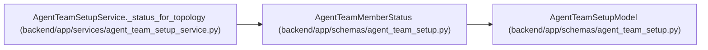

# AgentTeamMemberStatus

**Location:** `backend/app/schemas/agent_team_setup.py:890`
**Kind:** Pydantic model
**Bases:** `AgentTeamSetupModel`
**Module:** [agent_team_setup](../modules/agent_team_setup.md)

## Description

_Auto-generated from `AgentTeamMemberStatus` in `backend/app/schemas/agent_team_setup.py`._

## Attributes

| Name | Type | Wire name | Required | Nullable | Default | Constraints | Examples | Description |
|------|------|-----------|----------|----------|---------|-------------|-------------|----------|
| `actor_key` | `str` | `actor_key` | Yes | No | — | pattern=unknown (STABLE_KEY_PATTERN) | — | — |
| `actor_id` | `int \| None` | `actor_id` | No | Yes | `None` | ge=1 | — | — |
| `actor_name` | `str` | `actor_name` | Yes | No | — | pattern=unknown (STABLE_KEY_PATTERN) | — | — |
| `display_name` | `str` | `display_name` | Yes | No | — | — | — | — |
| `role` | `Literal['pm', 'worker', 'verifier']` | `role` | Yes | No | — | — | — | — |
| `desired` | `bool` | `desired` | Yes | No | — | — | — | — |
| `configured` | `bool` | `configured` | Yes | No | — | — | — | — |
| `lifecycle_state` | `AgentTeamMemberLifecycle` | `lifecycle_state` | Yes | No | — | — | — | — |
| `enabled` | `bool` | `enabled` | Yes | No | — | — | — | — |
| `profile_key` | `str` | `profile_key` | Yes | No | — | pattern=unknown (STABLE_KEY_PATTERN) | — | — |
| `profile_revision` | `str \| None` | `profile_revision` | No | Yes | `None` | — | — | — |
| `binding_revisions` | `dict[str, int]` | `binding_revisions` | No | No | factory: `dict` | — | — | — |
| `skill_package` | `AgentTeamSkillPackage` | `skill_package` | Yes | No | — | — | — | — |
| `package_acknowledged` | `bool` | `package_acknowledged` | Yes | No | — | — | — | — |
| `credential_delivery_state` | `Literal['pending', 'delivered', 'uncertain', 'not_required']` | `credential_delivery_state` | Yes | No | — | — | — | — |
| `connection_state` | `Literal['unobserved', 'observed', 'stale']` | `connection_state` | Yes | No | — | — | — | — |
| `last_seen_at` | `datetime \| None` | `last_seen_at` | No | Yes | `None` | — | — | — |
| `queued_assignments` | `int \| None` | `queued_assignments` | No | Yes | `None` | ge=0 | — | — |
| `accepted_assignments` | `int \| None` | `accepted_assignments` | No | Yes | `None` | ge=0 | — | — |
| `running_runs` | `int \| None` | `running_runs` | No | Yes | `None` | ge=0 | — | — |
| `runtime_ready` | `bool` | `runtime_ready` | Yes | No | — | — | — | — |
| `availability` | `Literal['availability_unknown']` | `availability` | No | No | `'availability_unknown'` | — | — | — |
| `blocker_codes` | `tuple[str, ...]` | `blocker_codes` | No | No | `()` | max_length=32 | — | — |
| `handoff` | `AgentTeamRuntimeHandoff \| None` | `handoff` | No | Yes | `None` | — | — | — |

## Methods

*No public methods. Inherits from base classes.*

## Relationships

<!-- Auto-generated relationship summary. Do not edit by hand. -->

### Summary

| Module | Methods | Attributes |
|---|---:|---|
| [agent_team_setup](../modules/agent_team_setup.md) | 0 | `accepted_assignments`, `actor_id`, `actor_key`, `actor_name`, `availability`, `binding_revisions`, `blocker_codes`, `configured`, `connection_state`, `credential_delivery_state`, `desired`, `display_name` |

### Structure

| Kind | Entity | Module |
|---|---|---|
| Base | `AgentTeamSetupModel` | [agent_team_setup](../modules/agent_team_setup.md) |

### References

| Reference | Kind | Source | Call sites |
|---|---|---|---:|
| `AgentTeamSetupService._status_for_topology` | call | [agent_team_setup_service](../modules/agent_team_setup_service.md) | 1 |
