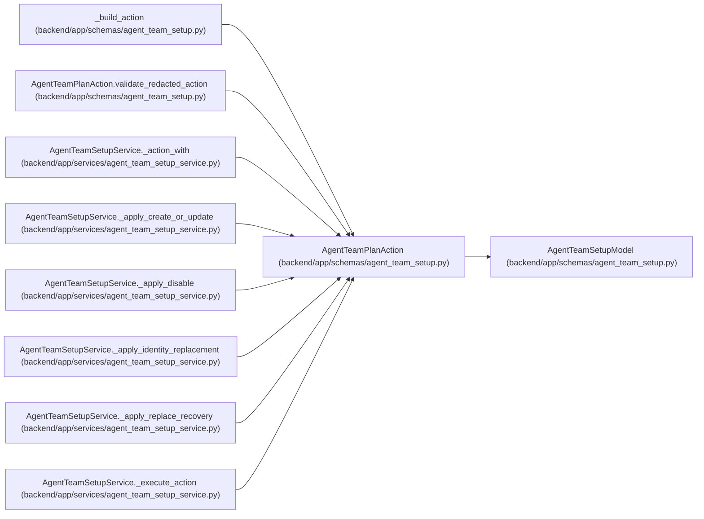

# AgentTeamPlanAction

**Location:** `backend/app/schemas/agent_team_setup.py:444`
**Kind:** Pydantic model
**Bases:** `AgentTeamSetupModel`
**Module:** [agent_team_setup](../modules/agent_team_setup.md)

## Description

One stable, redacted reconciliation decision.

## Validators

| Method | Scope | Fields | Mode | Options |
|--------|-------|--------|------|---------|
| `validate_redacted_action` | model | — | after | — |

## Attributes

| Name | Type | Wire name | Required | Nullable | Default | Constraints | Examples | Description |
|------|------|-----------|----------|----------|---------|-------------|-------------|----------|
| `action_id` | `str` | `action_id` | Yes | No | — | max_length=128; pattern=unknown (ACTION_ID_PATTERN) | — | — |
| `action_digest` | `str` | `action_digest` | Yes | No | — | pattern=unknown (SHA256_PATTERN) | — | — |
| `reconciliation_class` | `AgentTeamReconciliationClass` | `reconciliation_class` | Yes | No | — | — | — | — |
| `operation` | `Literal['create_member', 'adopt_member', 'update_member', 'no_change', 'disable_member', 'replace_member', 'blocked', 'unmanaged']` | `operation` | Yes | No | — | — | — | — |
| `actor_key` | `str` | `actor_key` | Yes | No | — | pattern=unknown (STABLE_KEY_PATTERN) | — | — |
| `target_actor_id` | `int \| None` | `target_actor_id` | No | Yes | `None` | ge=1 | — | — |
| `expected_object_revision` | `int \| None` | `expected_object_revision` | No | Yes | `None` | ge=1 | — | — |
| `expected_actor_revision` | `int \| None` | `expected_actor_revision` | No | Yes | `None` | ge=1 | — | — |
| `before` | `dict[str, Any] \| None` | `before` | No | Yes | `None` | — | — | — |
| `after` | `dict[str, Any] \| None` | `after` | No | Yes | `None` | — | — | — |
| `preconditions` | `dict[str, Any]` | `preconditions` | No | No | factory: `dict` | max_length=32 | — | — |
| `blocker_code` | `str \| None` | `blocker_code` | No | Yes | `None` | max_length=128; pattern=unknown (FEATURE_PATTERN) | — | — |
| `requires_explicit_confirmation` | `bool` | `requires_explicit_confirmation` | No | No | `False` | — | — | — |
| `authority_change` | `bool` | `authority_change` | No | No | `False` | — | — | — |

## Methods

| Method | Signature | Decorators | Description |
|--------|-----------|------------|-------------|
| `validate_redacted_action` | `() -> 'AgentTeamPlanAction'` | `@model_validator(mode='after')` | — |

## Relationships

<!-- Auto-generated relationship summary. Do not edit by hand. -->

### Summary

| Module | Methods | Attributes |
|---|---:|---|
| [agent_team_setup](../modules/agent_team_setup.md) | 1 | `action_digest`, `action_id`, `actor_key`, `after`, `authority_change`, `before`, `blocker_code`, `expected_actor_revision`, `expected_object_revision`, `operation`, `preconditions`, `reconciliation_class` |

### Structure

| Kind | Entity | Module |
|---|---|---|
| Base | `AgentTeamSetupModel` | [agent_team_setup](../modules/agent_team_setup.md) |

### References

| Reference | Kind | Source | Call sites |
|---|---|---|---:|
| `_build_action` | call | [agent_team_setup](../modules/agent_team_setup.md) | 1 |
| `_build_action` | type_reference | [agent_team_setup](../modules/agent_team_setup.md) | — |
| `AgentTeamPlanAction.validate_redacted_action` | type_reference | [agent_team_setup](../modules/agent_team_setup.md) | — |
| `AgentTeamSetupService._action_with` | type_reference | [agent_team_setup_service](../modules/agent_team_setup_service.md) | — |
| `AgentTeamSetupService._apply_create_or_update` | type_reference | [agent_team_setup_service](../modules/agent_team_setup_service.md) | — |
| `AgentTeamSetupService._apply_disable` | type_reference | [agent_team_setup_service](../modules/agent_team_setup_service.md) | — |
| `AgentTeamSetupService._apply_identity_replacement` | type_reference | [agent_team_setup_service](../modules/agent_team_setup_service.md) | — |
| `AgentTeamSetupService._apply_replace_recovery` | type_reference | [agent_team_setup_service](../modules/agent_team_setup_service.md) | — |
| `AgentTeamSetupService._execute_action` | type_reference | [agent_team_setup_service](../modules/agent_team_setup_service.md) | — |
