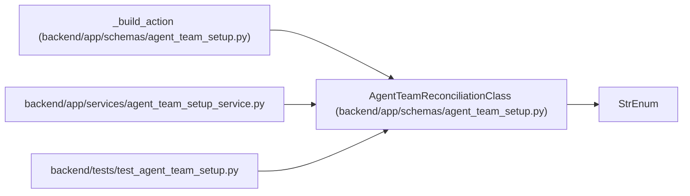

# AgentTeamReconciliationClass

**Location:** `backend/app/schemas/agent_team_setup.py:104`
**Kind:** Enum
**Bases:** `StrEnum`
**Module:** [agent_team_setup](../modules/agent_team_setup.md)

## Description

_Auto-generated from `AgentTeamReconciliationClass` in `backend/app/schemas/agent_team_setup.py`._

## Attributes

| Name | Declared value | Description |
|------|-------|-------------|
| `CREATE` | `'create'` | — |
| `SAFE_UPDATE` | `'safe_update'` | — |
| `NO_CHANGE` | `'no_change'` | — |
| `BLOCKED_CONFLICT` | `'blocked_conflict'` | — |
| `REQUIRES_REPLACEMENT` | `'requires_replacement'` | — |
| `PROPOSE_DISABLE` | `'propose_disable'` | — |
| `UNMANAGED` | `'unmanaged'` | — |

## Methods

*No public methods. Inherits from base classes.*

## Relationships

<!-- Auto-generated relationship summary. Do not edit by hand. -->

### Summary

| Module | Methods | Attributes |
|---|---:|---|
| [agent_team_setup](../modules/agent_team_setup.md) | 0 | `BLOCKED_CONFLICT`, `CREATE`, `NO_CHANGE`, `PROPOSE_DISABLE`, `REQUIRES_REPLACEMENT`, `SAFE_UPDATE`, `UNMANAGED` |

### Structure

| Kind | Entity | Module |
|---|---|---|
| Base | `StrEnum` | — |

### References

| Reference | Kind | Source | Call sites |
|---|---|---|---:|
| `_build_action` | type_reference | [agent_team_setup](../modules/agent_team_setup.md) | — |
| `agent_team_setup_service` | import | [agent_team_setup_service](../modules/agent_team_setup_service.md) | — |
| `test_agent_team_setup` | import | [test_agent_team_setup](../modules/test_agent_team_setup.md) | — |
