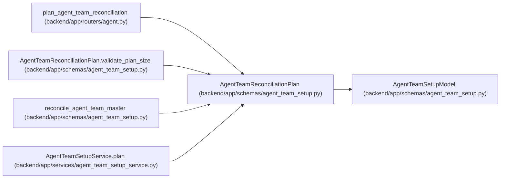

# AgentTeamReconciliationPlan

**Location:** `backend/app/schemas/agent_team_setup.py:481`
**Kind:** Pydantic model
**Bases:** `AgentTeamSetupModel`
**Module:** [agent_team_setup](../modules/agent_team_setup.md)

## Description

Digest-bound dry-run output applied only by exact action ID.

## Validators

| Method | Scope | Fields | Mode | Options |
|--------|-------|--------|------|---------|
| `normalize_blocker_codes` | field | blocker_codes | after | — |
| `validate_plan_size` | model | — | after | — |

## Attributes

| Name | Type | Wire name | Required | Nullable | Default | Constraints | Examples | Description |
|------|------|-----------|----------|----------|---------|-------------|-------------|----------|
| `schema_version` | `Literal['agent-team-reconciliation-plan-v1']` | `schema_version` | No | No | `AGENT_TEAM_PLAN_SCHEMA_VERSION` | — | — | — |
| `topology_key` | `str` | `topology_key` | Yes | No | — | pattern=unknown (STABLE_KEY_PATTERN) | — | — |
| `expected_topology_revision` | `int` | `expected_topology_revision` | Yes | No | — | ge=0 | — | — |
| `manifest_digest` | `str` | `manifest_digest` | Yes | No | — | pattern=unknown (SHA256_PATTERN) | — | — |
| `actions` | `tuple[AgentTeamPlanAction, ...]` | `actions` | Yes | No | — | max_length=unknown (MAX_AGENT_TEAM_ACTIONS) | — | — |
| `blocker_codes` | `tuple[str, ...]` | `blocker_codes` | No | No | `()` | max_length=unknown (MAX_AGENT_TEAM_BLOCKERS) | — | — |
| `plan_digest` | `str` | `plan_digest` | Yes | No | — | pattern=unknown (SHA256_PATTERN) | — | — |

## Methods

| Method | Signature | Decorators | Description |
|--------|-----------|------------|-------------|
| `normalize_blocker_codes` | `(value: tuple[str, ...]) -> tuple[str, ...]` | `@field_validator('blocker_codes')`, `@classmethod` | — |
| `validate_plan_size` | `() -> 'AgentTeamReconciliationPlan'` | `@model_validator(mode='after')` | — |

## Relationships

<!-- Auto-generated relationship summary. Do not edit by hand. -->

### Summary

| Module | Methods | Attributes |
|---|---:|---|
| [agent_team_setup](../modules/agent_team_setup.md) | 2 | `actions`, `blocker_codes`, `expected_topology_revision`, `manifest_digest`, `plan_digest`, `schema_version`, `topology_key` |

### Structure

| Kind | Entity | Module |
|---|---|---|
| Base | `AgentTeamSetupModel` | [agent_team_setup](../modules/agent_team_setup.md) |

### References

| Reference | Kind | Source | Call sites |
|---|---|---|---:|
| `plan_agent_team_reconciliation` | type_reference | [routers_agent](../modules/routers_agent.md) | — |
| `AgentTeamReconciliationPlan.validate_plan_size` | type_reference | [agent_team_setup](../modules/agent_team_setup.md) | — |
| `reconcile_agent_team_master` | call | [agent_team_setup](../modules/agent_team_setup.md) | 1 |
| `reconcile_agent_team_master` | type_reference | [agent_team_setup](../modules/agent_team_setup.md) | — |
| `AgentTeamSetupService.plan` | call | [agent_team_setup_service](../modules/agent_team_setup_service.md) | 1 |
| `AgentTeamSetupService.plan` | type_reference | [agent_team_setup_service](../modules/agent_team_setup_service.md) | — |
