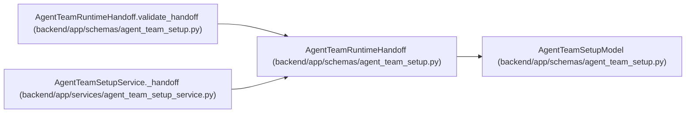

# AgentTeamRuntimeHandoff

**Location:** `backend/app/schemas/agent_team_setup.py:863`
**Kind:** Pydantic model
**Bases:** `AgentTeamSetupModel`
**Module:** [agent_team_setup](../modules/agent_team_setup.md)

## Description

_Auto-generated from `AgentTeamRuntimeHandoff` in `backend/app/schemas/agent_team_setup.py`._

## Validators

| Method | Scope | Fields | Mode | Options |
|--------|-------|--------|------|---------|
| `validate_handoff` | model | — | after | — |

## Attributes

| Name | Type | Wire name | Required | Nullable | Default | Constraints | Examples | Description |
|------|------|-----------|----------|----------|---------|-------------|-------------|----------|
| `schema_version` | `Literal['agent-team-runtime-handoff-v1']` | `schema_version` | No | No | `AGENT_TEAM_HANDOFF_SCHEMA_VERSION` | — | — | — |
| `topology_key` | `str` | `topology_key` | Yes | No | — | pattern=unknown (STABLE_KEY_PATTERN) | — | — |
| `topology_revision` | `int` | `topology_revision` | Yes | No | — | ge=1 | — | — |
| `actor_key` | `str` | `actor_key` | Yes | No | — | pattern=unknown (STABLE_KEY_PATTERN) | — | — |
| `actor_id` | `int` | `actor_id` | Yes | No | — | ge=1 | — | — |
| `role` | `Literal['pm', 'worker', 'verifier']` | `role` | Yes | No | — | — | — | — |
| `server_url` | `str` | `server_url` | Yes | No | — | — | — | — |
| `required_server_features` | `tuple[str, ...]` | `required_server_features` | Yes | No | — | — | — | — |
| `skill_package` | `AgentTeamSkillPackage` | `skill_package` | Yes | No | — | — | — | — |
| `profile_key` | `str` | `profile_key` | Yes | No | — | pattern=unknown (STABLE_KEY_PATTERN) | — | — |
| `profile_revision` | `str` | `profile_revision` | Yes | No | — | — | — | — |
| `model_binding_revisions` | `dict[str, int]` | `model_binding_revisions` | Yes | No | — | — | — | — |
| `supported_assignment_modes` | `tuple[str, ...]` | `supported_assignment_modes` | Yes | No | — | — | — | — |
| `startup_instructions` | `tuple[str, ...]` | `startup_instructions` | Yes | No | — | max_length=16; min_length=1 | — | — |
| `credential_ref` | `str` | `credential_ref` | Yes | No | — | max_length=1024; min_length=1 | — | — |

## Methods

| Method | Signature | Decorators | Description |
|--------|-----------|------------|-------------|
| `validate_handoff` | `() -> 'AgentTeamRuntimeHandoff'` | `@model_validator(mode='after')` | — |

## Relationships

<!-- Auto-generated relationship summary. Do not edit by hand. -->

### Summary

| Module | Methods | Attributes |
|---|---:|---|
| [agent_team_setup](../modules/agent_team_setup.md) | 1 | `actor_id`, `actor_key`, `credential_ref`, `model_binding_revisions`, `profile_key`, `profile_revision`, `required_server_features`, `role`, `schema_version`, `server_url`, `skill_package`, `startup_instructions` |

### Structure

| Kind | Entity | Module |
|---|---|---|
| Base | `AgentTeamSetupModel` | [agent_team_setup](../modules/agent_team_setup.md) |

### References

| Reference | Kind | Source | Call sites |
|---|---|---|---:|
| `AgentTeamRuntimeHandoff.validate_handoff` | type_reference | [agent_team_setup](../modules/agent_team_setup.md) | — |
| `AgentTeamSetupService._handoff` | call | [agent_team_setup_service](../modules/agent_team_setup_service.md) | 1 |
| `AgentTeamSetupService._handoff` | type_reference | [agent_team_setup_service](../modules/agent_team_setup_service.md) | — |
