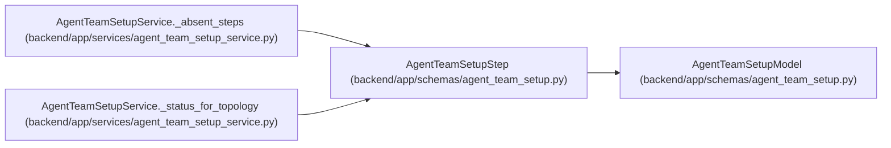

# AgentTeamSetupStep

**Location:** `backend/app/schemas/agent_team_setup.py:926`
**Kind:** Pydantic model
**Bases:** `AgentTeamSetupModel`
**Module:** [agent_team_setup](../modules/agent_team_setup.md)

## Description

_Auto-generated from `AgentTeamSetupStep` in `backend/app/schemas/agent_team_setup.py`._

## Attributes

| Name | Type | Wire name | Required | Nullable | Default | Constraints | Examples | Description |
|------|------|-----------|----------|----------|---------|-------------|-------------|----------|
| `id` | `Literal['authority', 'master', 'controller', 'workers', 'bindings', 'verifier', 'review']` | `id` | Yes | No | — | — | — | — |
| `state` | `Literal['done', 'warn', 'blocked', 'todo']` | `state` | Yes | No | — | — | — | — |
| `blocker_codes` | `tuple[str, ...]` | `blocker_codes` | No | No | `()` | max_length=32 | — | — |
| `next_action` | `str \| None` | `next_action` | No | Yes | `None` | max_length=255 | — | — |

## Methods

*No public methods. Inherits from base classes.*

## Relationships

<!-- Auto-generated relationship summary. Do not edit by hand. -->

### Summary

| Module | Methods | Attributes |
|---|---:|---|
| [agent_team_setup](../modules/agent_team_setup.md) | 0 | `blocker_codes`, `id`, `next_action`, `state` |

### Structure

| Kind | Entity | Module |
|---|---|---|
| Base | `AgentTeamSetupModel` | [agent_team_setup](../modules/agent_team_setup.md) |

### References

| Reference | Kind | Source | Call sites |
|---|---|---|---:|
| `AgentTeamSetupService._absent_steps` | call | [agent_team_setup_service](../modules/agent_team_setup_service.md) | 7 |
| `AgentTeamSetupService._absent_steps` | type_reference | [agent_team_setup_service](../modules/agent_team_setup_service.md) | — |
| `AgentTeamSetupService._status_for_topology` | call | [agent_team_setup_service](../modules/agent_team_setup_service.md) | 7 |
