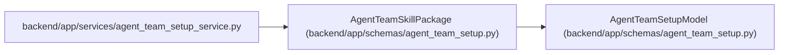

# AgentTeamSkillPackage

**Location:** `backend/app/schemas/agent_team_setup.py:168`
**Kind:** Pydantic model
**Bases:** `AgentTeamSetupModel`
**Module:** [agent_team_setup](../modules/agent_team_setup.md)

## Description

Exact immutable role-package identity expected by one runtime.

## Attributes

| Name | Type | Wire name | Required | Nullable | Default | Constraints | Examples | Description |
|------|------|-----------|----------|----------|---------|-------------|-------------|----------|
| `name` | `str` | `name` | Yes | No | — | pattern=unknown (STABLE_KEY_PATTERN) | — | — |
| `version` | `str` | `version` | Yes | No | — | pattern=unknown (SEMVER_PATTERN) | — | — |
| `sha256` | `str` | `sha256` | Yes | No | — | pattern=unknown (SHA256_PATTERN) | — | — |

## Methods

*No public methods. Inherits from base classes.*

## Relationships

<!-- Auto-generated relationship summary. Do not edit by hand. -->

### Summary

| Module | Methods | Attributes |
|---|---:|---|
| [agent_team_setup](../modules/agent_team_setup.md) | 0 | `name`, `sha256`, `version` |

### Structure

| Kind | Entity | Module |
|---|---|---|
| Base | `AgentTeamSetupModel` | [agent_team_setup](../modules/agent_team_setup.md) |

### References

| Reference | Kind | Source | Call sites |
|---|---|---|---:|
| `agent_team_setup_service` | import | [agent_team_setup_service](../modules/agent_team_setup_service.md) | — |
