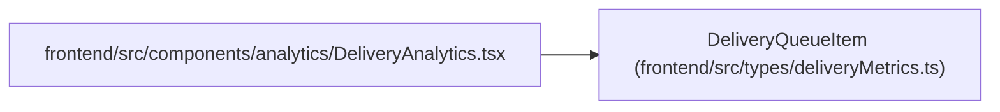

# DeliveryQueueItem

**Location:** `frontend/src/types/deliveryMetrics.ts:10`
**Kind:** Class
**Bases:** —
**Module:** [deliveryMetrics](../modules/deliveryMetrics.md)

## Description

_Auto-generated from `DeliveryQueueItem` in `frontend/src/types/deliveryMetrics.ts`._

## Attributes

| Name | Type | Required | Default | Description |
|------|------|----------|---------|-------------|
| `task_id` | `number` | Yes | — | — |
| `title` | `string` | Yes | — | — |
| `reason` | `string` | Yes | — | — |
| `age_seconds` | `number \| null` | Yes | — | — |

## Methods

*No public methods. Inherits from base classes.*

## Relationships

<!-- Auto-generated relationship summary. Do not edit by hand. -->

### Summary

| Module | Methods | Attributes |
|---|---:|---|
| [deliveryMetrics](../modules/deliveryMetrics.md) | 0 | `age_seconds`, `reason`, `task_id`, `title` |

### References

| Reference | Kind | Source | Call sites |
|---|---|---|---:|
| `DeliveryAnalytics` | import | [DeliveryAnalytics](../modules/DeliveryAnalytics.md) | — |
