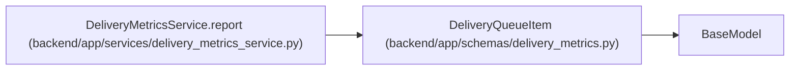

# DeliveryQueueItem

**Location:** `backend/app/schemas/delivery_metrics.py:16`
**Kind:** Pydantic model
**Bases:** `BaseModel`
**Module:** [delivery_metrics](../modules/delivery_metrics.md)

## Description

_Auto-generated from `DeliveryQueueItem` in `backend/app/schemas/delivery_metrics.py`._

## Attributes

| Name | Type | Wire name | Required | Nullable | Default | Constraints | Examples | Description |
|------|------|-----------|----------|----------|---------|-------------|-------------|----------|
| `task_id` | `int` | `task_id` | Yes | No | — | — | — | — |
| `title` | `str` | `title` | Yes | No | — | — | — | — |
| `reason` | `str` | `reason` | Yes | No | — | — | — | — |
| `age_seconds` | `float \| None` | `age_seconds` | Yes | Yes | — | — | — | — |

## Methods

*No public methods. Inherits from base classes.*

## Relationships

<!-- Auto-generated relationship summary. Do not edit by hand. -->

### Summary

| Module | Methods | Attributes |
|---|---:|---|
| [delivery_metrics](../modules/delivery_metrics.md) | 0 | `age_seconds`, `reason`, `task_id`, `title` |

### Structure

| Kind | Entity | Module |
|---|---|---|
| Base | `BaseModel` | — |

### References

| Reference | Kind | Source | Call sites |
|---|---|---|---:|
| `DeliveryMetricsService.report` | call | [delivery_metrics_service](../modules/delivery_metrics_service.md) | 2 |
