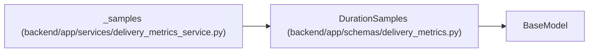

# DurationSamples

**Location:** `backend/app/schemas/delivery_metrics.py:7`
**Kind:** Pydantic model
**Bases:** `BaseModel`
**Module:** [delivery_metrics](../modules/delivery_metrics.md)

## Description

_Auto-generated from `DurationSamples` in `backend/app/schemas/delivery_metrics.py`._

## Attributes

| Name | Type | Wire name | Required | Nullable | Default | Constraints | Examples | Description |
|------|------|-----------|----------|----------|---------|-------------|-------------|----------|
| `unit` | `str` | `unit` | No | No | `'elapsed_seconds'` | — | — | — |
| `sample_count` | `int` | `sample_count` | No | No | `0` | — | — | — |
| `mean` | `float \| None` | `mean` | No | Yes | `None` | — | — | — |
| `median` | `float \| None` | `median` | No | Yes | `None` | — | — | — |
| `censored_count` | `int` | `censored_count` | No | No | `0` | — | — | — |
| `unknown_count` | `int` | `unknown_count` | No | No | `0` | — | — | — |

## Methods

*No public methods. Inherits from base classes.*

## Relationships

<!-- Auto-generated relationship summary. Do not edit by hand. -->

### Summary

| Module | Methods | Attributes |
|---|---:|---|
| [delivery_metrics](../modules/delivery_metrics.md) | 0 | `censored_count`, `mean`, `median`, `sample_count`, `unit`, `unknown_count` |

### Structure

| Kind | Entity | Module |
|---|---|---|
| Base | `BaseModel` | — |

### References

| Reference | Kind | Source | Call sites |
|---|---|---|---:|
| `_samples` | call | [delivery_metrics_service](../modules/delivery_metrics_service.md) | 1 |
