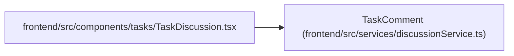

# TaskComment

**Location:** `frontend/src/services/discussionService.ts:3`
**Kind:** Class
**Bases:** —
**Module:** [discussionService](../modules/discussionService.md)

## Description

_Auto-generated from `TaskComment` in `frontend/src/services/discussionService.ts`._

## Attributes

| Name | Type | Required | Default | Description |
|------|------|----------|---------|-------------|
| `id` | `number` | Yes | — | — |
| `task_id` | `number` | Yes | — | — |
| `principal_id` | `number` | Yes | — | — |
| `author_name` | `string` | Yes | — | — |
| `body` | `string` | Yes | — | — |
| `mentions` | `number[]` | Yes | — | — |
| `version` | `number` | Yes | — | — |
| `deleted` | `boolean` | Yes | — | — |
| `created_at` | `string` | Yes | — | — |
| `updated_at` | `string` | Yes | — | — |

## Methods

*No public methods. Inherits from base classes.*

## Relationships

<!-- Auto-generated relationship summary. Do not edit by hand. -->

### Summary

| Module | Methods | Attributes |
|---|---:|---|
| [discussionService](../modules/discussionService.md) | 0 | `author_name`, `body`, `created_at`, `deleted`, `id`, `mentions`, `principal_id`, `task_id`, `updated_at`, `version` |

### References

| Reference | Kind | Source | Call sites |
|---|---|---|---:|
| `TaskDiscussion` | import | [TaskDiscussion](../modules/TaskDiscussion.md) | — |
