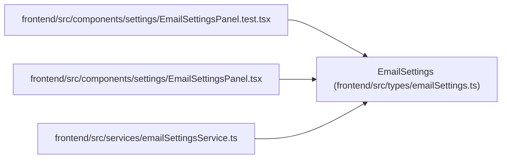

# EmailSettings

**Location:** `frontend/src/types/emailSettings.ts:3`
**Kind:** Class
**Bases:** —
**Module:** [emailSettings](../modules/emailSettings.md)

## Description

_Auto-generated from `EmailSettings` in `frontend/src/types/emailSettings.ts`._

## Attributes

| Name | Type | Default | Description |
|------|------|---------|-------------|
| `enabled` | `boolean` | *required* | — |
| `smtp_host` | `string` | *required* | — |
| `smtp_port` | `number` | *required* | — |
| `smtp_user` | `string` | *required* | — |
| `smtp_from_email` | `string` | *required* | — |
| `smtp_use_tls` | `boolean` | *required* | — |
| `has_password` | `boolean` | *required* | — |
| `smtp_password` | `string` | *required* | — |
| `clear_smtp_password` | `boolean` | *required* | — |
| `field_sources` | `Record<string, RuntimeSettingSource>` | *required* | — |

## Methods

*No public methods. Inherits from base classes.*

## Relationships

<!-- Auto-generated relationship summary. Do not edit by hand. -->

### Summary

| Module | Methods | Attributes |
|---|---:|---|
| [emailSettings](../modules/emailSettings.md) | 0 | `clear_smtp_password`, `enabled`, `field_sources`, `has_password`, `smtp_from_email`, `smtp_host`, `smtp_password`, `smtp_port`, `smtp_use_tls`, `smtp_user` |

### References

| Reference | Kind | Source | Call sites |
|---|---|---|---:|
| `EmailSettingsPanel.test` | import | [EmailSettingsPanel.test](../modules/EmailSettingsPanel.test.md) | — |
| `EmailSettingsPanel` | import | [EmailSettingsPanel](../modules/EmailSettingsPanel.md) | — |
| `emailSettingsService` | import | [emailSettingsService](../modules/emailSettingsService.md) | — |
