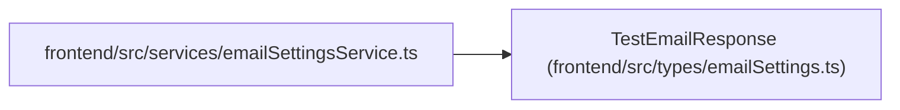

# TestEmailResponse

**Location:** `frontend/src/types/emailSettings.ts:32`
**Kind:** Class
**Bases:** —
**Module:** [emailSettings](../modules/emailSettings.md)

## Description

_Auto-generated from `TestEmailResponse` in `frontend/src/types/emailSettings.ts`._

## Attributes

| Name | Type | Default | Description |
|------|------|---------|-------------|
| `success` | `boolean` | *required* | — |
| `message` | `string` | *required* | — |

## Methods

*No public methods. Inherits from base classes.*

## Relationships

<!-- Auto-generated relationship summary. Do not edit by hand. -->

### Summary

| Module | Methods | Attributes |
|---|---:|---|
| [emailSettings](../modules/emailSettings.md) | 0 | `message`, `success` |

### References

| Reference | Kind | Source | Call sites |
|---|---|---|---:|
| `emailSettingsService` | import | [emailSettingsService](../modules/emailSettingsService.md) | — |
