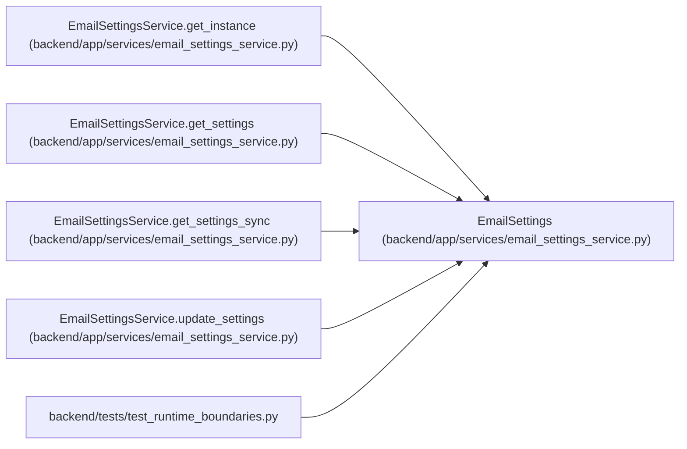

# EmailSettings

**Location:** `backend/app/services/email_settings_service.py:26`
**Kind:** Class
**Bases:** —
**Module:** [email_settings_service](../modules/email_settings_service.md)

**Decorators:** `@dataclass`

## Description

Resolved email settings.

## Attributes

| Name | Type | Default | Description |
|------|------|---------|-------------|
| `enabled` | `bool` | `False` | — |
| `smtp_host` | `str` | `''` | — |
| `smtp_port` | `int` | `587` | — |
| `smtp_user` | `str` | `''` | — |
| `smtp_password` | `str` | `''` | — |
| `smtp_from_email` | `str` | `'notifications@workchord.local'` | — |
| `smtp_use_tls` | `bool` | `True` | — |
| `field_sources` | `dict[str, RuntimeSettingSource]` | `field(default_factory=dict)` | — |
| `password_configured` | `Optional[bool]` | `None` | — |

## Methods

| Method | Signature | Decorators | Description |
|--------|-----------|------------|-------------|
| `has_password` | `() -> bool` | `@property` | Return whether an SMTP password is configured. |
| `is_configured` | `() -> bool` | `@property` | Return whether email can be attempted. |

## Relationships

<!-- Auto-generated relationship summary. Do not edit by hand. -->

### Summary

| Module | Methods | Attributes |
|---|---:|---|
| [email_settings_service](../modules/email_settings_service.md) | 2 | `enabled`, `field_sources`, `password_configured`, `smtp_from_email`, `smtp_host`, `smtp_password`, `smtp_port`, `smtp_use_tls`, `smtp_user` |

### References

| Reference | Kind | Source | Call sites |
|---|---|---|---:|
| `EmailSettingsService.get_instance` | type_reference | [email_settings_service](../modules/email_settings_service.md) | — |
| `EmailSettingsService.get_settings` | call | [email_settings_service](../modules/email_settings_service.md) | 1 |
| `EmailSettingsService.get_settings` | type_reference | [email_settings_service](../modules/email_settings_service.md) | — |
| `EmailSettingsService.get_settings_sync` | call | [email_settings_service](../modules/email_settings_service.md) | 2 |
| `EmailSettingsService.get_settings_sync` | type_reference | [email_settings_service](../modules/email_settings_service.md) | — |
| `EmailSettingsService.update_settings` | call | [email_settings_service](../modules/email_settings_service.md) | 1 |
| `EmailSettingsService.update_settings` | type_reference | [email_settings_service](../modules/email_settings_service.md) | — |
| `test_runtime_boundaries` | import | [test_runtime_boundaries](../modules/test_runtime_boundaries.md) | — |
