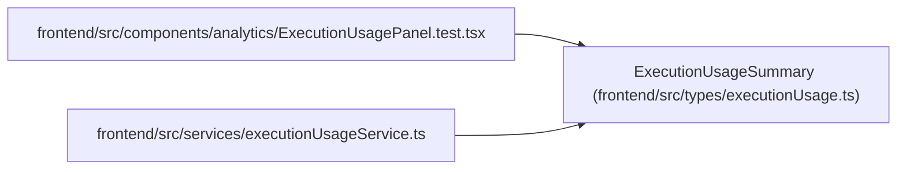

# ExecutionUsageSummary

**Location:** `frontend/src/types/executionUsage.ts:1`
**Kind:** Class
**Bases:** —
**Module:** [executionUsage](../modules/executionUsage.md)

## Description

_Auto-generated from `ExecutionUsageSummary` in `frontend/src/types/executionUsage.ts`._

## Attributes

| Name | Type | Required | Default | Description |
|------|------|----------|---------|-------------|
| `window_start` | `string` | Yes | — | — |
| `window_end` | `string` | Yes | — | — |
| `window_basis` | `string` | Yes | — | — |
| `expected_runs` | `number` | Yes | — | — |
| `reported_runs` | `number` | Yes | — | — |
| `unreported_runs` | `number` | Yes | — | — |
| `partial_reports` | `number` | Yes | — | — |
| `unavailable_reports` | `number` | Yes | — | — |
| `simulated_reports` | `number` | Yes | — | — |
| `measured_report_count` | `number` | Yes | — | — |
| `provider_reported_cost` | `Record<string, string \| null>` | Yes | — | — |
| `estimated_cost` | `Record<string, string \| null>` | Yes | — | — |
| `known_cost_reports` | `Record<string, number>` | Yes | — | — |
| `unknown_cost_reports` | `number` | Yes | — | — |
| `accepted_task_identities` | `number` | Yes | — | — |
| `reports_linked_to_accepted_tasks` | `number` | Yes | — | — |
| `reported_human_effort_minutes` | `string \| null` | Yes | — | — |
| `human_effort_reports` | `number` | Yes | — | — |
| `reported_units` | `Record<string, string \| null>` | Yes | — | — |
| `unit_report_counts` | `Record<string, number>` | Yes | — | — |
| `simulated_reported_cost` | `Record<string, string>` | Yes | — | — |
| `simulated_estimated_cost` | `Record<string, string>` | Yes | — | — |
| `simulated_units` | `Record<string, string \| null>` | Yes | — | — |
| `independently_reconciled` | `false` | Yes | — | — |
| `advisory_budget` | `{ amount: string; currency: string; known_reported_cost: string \| null;         known_estimated_cost: string \| null; coverage: string; advisory_only: true } \| null` | Yes | — | — |

## Methods

*No public methods. Inherits from base classes.*

## Relationships

<!-- Auto-generated relationship summary. Do not edit by hand. -->

### Summary

| Module | Methods | Attributes |
|---|---:|---|
| [executionUsage](../modules/executionUsage.md) | 0 | `accepted_task_identities`, `advisory_budget`, `estimated_cost`, `expected_runs`, `human_effort_reports`, `independently_reconciled`, `known_cost_reports`, `measured_report_count`, `partial_reports`, `provider_reported_cost`, `reported_human_effort_minutes`, `reported_runs` |

### References

| Reference | Kind | Source | Call sites |
|---|---|---|---:|
| `ExecutionUsagePanel.test` | import | [ExecutionUsagePanel.test](../modules/ExecutionUsagePanel.test.md) | — |
| `executionUsageService` | import | [executionUsageService](../modules/executionUsageService.md) | — |
