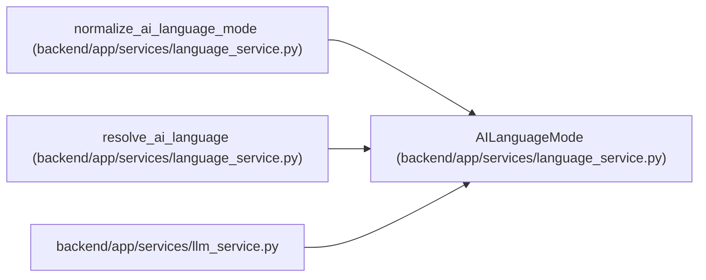

# AILanguageMode

**Location:** `backend/app/services/language_service.py:12`
**Kind:** Type alias
**Bases:** —
**Module:** [language_service](../modules/language_service.md)
**Target:** `Literal['auto', 'en', 'ru']`

## Description

_Auto-generated from `AILanguageMode` in `backend/app/services/language_service.py`._

## Attributes

*No annotated attributes found.*

## Methods

*No public methods. Inherits from base classes.*

## Relationships

<!-- Auto-generated relationship summary. Do not edit by hand. -->

### Summary

| Module | Methods | Attributes |
|---|---:|---|
| [language_service](../modules/language_service.md) | 0 | — |

### References

| Reference | Kind | Source | Call sites |
|---|---|---|---:|
| `normalize_ai_language_mode` | type_reference | [language_service](../modules/language_service.md) | — |
| `resolve_ai_language` | type_reference | [language_service](../modules/language_service.md) | — |
| `llm_service` | import | [llm_service](../modules/llm_service.md) | — |
